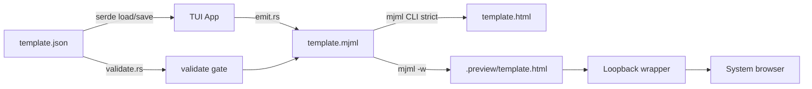
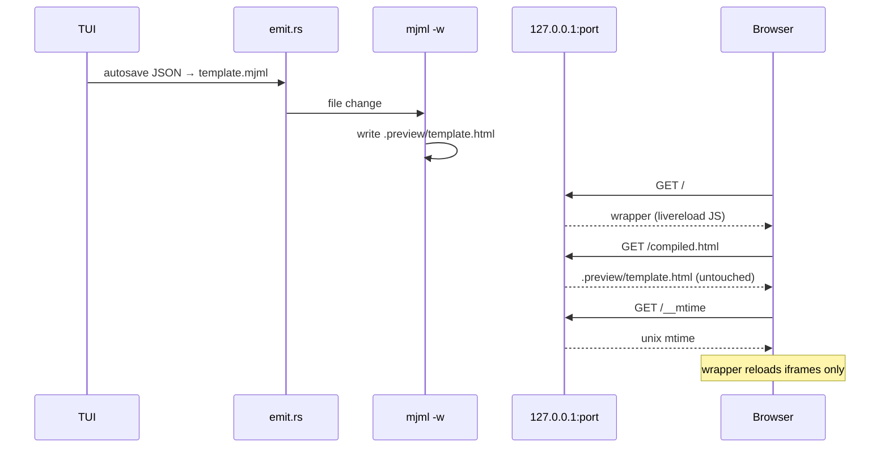
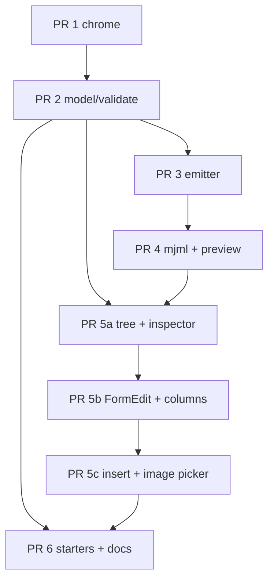

# dd_emailforge — Design Document

| Field | Value |
|---|---|
| **Author** | ldnddev |
| **Date** | 2026-09-02 |
| **Status** | Draft |
| **Crate** | `dd_emailforge` 0.1.0 |
| **License** | MIT |
| **Visual contract** | `LDNDDEV_TUI_VISUAL_STANDARD.md` v1 |
| **Sibling analog** | `dd_siteforge` (chrome and habits, not body layout) |

---

## Overview

`dd_emailforge` is a greenfield terminal-UI email template builder in the ldnddev TUI family. Authors design a single email in a Ratatui TUI; the app persists a typed `template.json`, emits clean strict MJML, and compiles that MJML with the **official Node `mjml` CLI** (MJML 5) into HTML that ESPs can paste. A local loopback preview serves a wrapper page with subject/preheader chrome and 600px + 320px iframes; livereload lives only in that wrapper.

JSON is the only source of truth. There is no MJML round-trip import in v1, no campaign container, and no shared `brand.json`. Brand tokens live on every template as first-class `mj-attributes`. The TUI body is a master/detail shell (structure tree + inspector), not a copy of siteforge's Regions/Pages/Layout sidebars.

The first shippable slice is family chrome only: crate, theme, 3-line header, empty body, 1-line footer, F1/F2, Ctrl+Q. The MJML pipeline, model, and editor land in subsequent PRs.

---

## Background & Motivation

CRM and marketing teams still author emails as opaque HTML, or in ESP drag-and-drop builders that do not produce reviewable artifacts. Developers want git-friendly source; designers want a visual tree; operators want HTML that matches what official MJML actually emits (Outlook, Gmail clip, merge tags).

`dd_siteforge` already solved the ldnddev TUI CMS shape for *web pages*: single binary, typed serde JSON, autosave + `.backup`, validate-then-export, insert picker, form-edit modals, image picker, theme lookup, F1/F2, toasts, mouse, tests via `send_key`. Email is a different document: 600px canvas, system font stacks, absolute image URLs, CAN-SPAM footer, preheader, and an external compiler. Copying siteforge's page/region/layout chrome would be a visual-standard violation (§6: body is app-defined).

Current repo state: no commits, only `LDNDDEV_TUI_VISUAL_STANDARD.md`. This is a new crate, not a fork of siteforge.

Pain points this app removes:

- Hand-written MJML that silently diverges from the HTML an ESP actually sends.
- Preview HTML that has livereload / relative assets baked in and then gets pasted into Mailchimp.
- A Rust-only compiler (`mrml`) producing HTML that is "close enough" but not what official MJML 5 produces.
- Theme tokens invented per app (`email_preview`, `mjml_tag`) that break the family palette.

---

## Goals & Non-Goals

### Goals (v1)

- Single binary, clap CLI: `init` / `tui` / `validate` / `export` / `preview` / `show`.
- One folder per template; `template.json` is the only document the TUI reads/writes.
- Typed serde JSON (`version: 1`); unknown versions are refused, not migrated.
- Rust emitter produces self-contained MJML 5 (no `mj-include`).
- Official `mjml` CLI compiles HTML with `validationLevel=strict`. Missing `mjml` is a blocking error, never a silent engine swap.
- Live browser preview via `mjml -w` + loopback wrapper (subject, preheader, 600 + 320 iframes).
- Brand as editable `mj-attributes` on every template.
- Visual-standard chrome: 3-line header, 1-line adaptive footer starting `F1:Help`, F1 Help, F2 Theme, toasts, modals, themed inputs, scrollbars, mouse, click-to-focus.
- Master/detail body: Structure tree + Details inspector with a 600px ascii map.
- Primitives 1:1 with a closed MJML subset, plus five opinionated blocks with `components/*.md` specs.
- Four init starters: `welcome`, `newsletter`, `promo`, `transactional`.
- Autosave (2s) of JSON; manual `s` also writes `template.json.backup`.
- Validate gate on export and preview (CLI and TUI F3).
- `install.sh` → `~/.local/bin/dd_emailforge`, theme to `$XDG_CONFIG_HOME/ldnddev/` if set else `~/.config/ldnddev/`, library dir created (empty).
- Tests in the siteforge style: module tests + TUI integration via in-tree `send_key`.
- Google Fonts (`mj-font`), JSON-LD in `mj-head` (emitter-wrapped `mj-raw`), and author CSS (`mj-style`).

### Non-goals (v1 — do not implement)

- MJML or HTML import / round-trip.
- Saved-template library UI (`~/.config/ldnddev/dd_emailforge/templates/` exists but is unused).
- Shared `brand.json` / `mj-include` partials / `allowIncludes`.
- `campaign.json` or a multi-template session.
- Free-form body `mj-raw`. JSON-LD is a **typed head field** the emitter wraps in `mj-raw`; authors do not insert raw MJML tags.
- Sample-data overlay for merge tags.
- ESP-specific export profiles, send-test, Litmus, dark-mode toggle.
- Non-Google font hosts (`typekit`, self-hosted `@font-face` files). Google Fonts CSS URLs only in v1.
- Regions / Pages / Layout sidebars, Grunt / SCSS / site webfonts pipeline, sitemap / robots / 404 / OG, SAL, `dd-modal` / `dd-slider`, Lando / DDEV.
- Using relative image paths as production URLs.
- Telemetry of any kind.
- Inventing theme tokens not in the visual standard.
- In-terminal HTML rendering.

### Later (explicitly deferred)

MJML import; sample-data overlay; ESP export profiles; send test; `mj-include`; save-to-library; high-level ldnddev email component pack; Litmus; dark-mode toggle.

---

## Key Decisions

1. **JSON is the only source of truth.** The TUI never edits `.mjml` or `.html`. Export and preview are pure functions of `template.json`. Rationale: git-friendly, typed, no MJML-parser-in-Rust problem, matches siteforge's `site.json` habit. Import is v2.

2. **Official MJML 5 CLI, not mrml.** HTML must be bit-for-what-official-produces. Preview and export share one engine. Rationale: ESP paste targets and client quirks are MJML's job; a second compiler would fork the product. Missing binary → blocking modal, no fallback.

3. **One JSON file, one folder, no campaign container.** Users keep templates in separate directories. Rationale: email workflows are per-template (welcome vs receipt); a campaign-of-pages model is a siteforge leftover.

4. **Brand is inlined `mj-attributes` on every template.** No shared include in v1. Rationale: MJML 5 disables includes by default (CVE-2025-67898); copying brand tokens into the JSON keeps v1 self-contained.

5. **Body layout is master/detail, not siteforge's three sidebars.** Visual standard §6 forbids copying another app's panels for consistency. One template is open at a time, so a template list in chrome would be dead UI.

6. **Self-contained MJML: never emit `mj-include`, never pass `--config.allowIncludes`.** MJML 5 default is `ignoreIncludes: true`. v1 stays on the secure default.

7. **Preview wrapper owns livereload; exported HTML does not.** Relative local images are rewritten only for the preview origin. Export requires `base_url` or absolute `https://` srcs.

8. **Merge tags are opaque strings.** The app does not parse `{{ }}`, `*| |*`, etc. They are XML-attribute-escaped and passed through `--config.templateSyntax`, `--config.sanitizeStyles true`, and `--config.allowMixedSyntax true` so declared delimiters survive juice/PostCSS. `sanitizeStyles` is the minify/PostCSS restore path (defense-in-depth even when we do not minify); `allowMixedSyntax` is required because the delimiter list includes both block tokens (``) and value tokens (`{{ }}`).

9. **Unknown `version` is fatal.** Do not guess or migrate. Greenfield schema; the only legal value in v1 is `1`. Missing `version` is a distinct error from `version != 1`.

10. **PR 1 is chrome only.** Family look-and-feel ships before the compiler, so visual-standard bugs are cheap to fix and later PRs sit on a tested shell.

11. **Single crate, not a dd_ftp-style workspace.** Siteforge is the analog (one `src/`, one binary). dd_ftp's crate split is for protocol stacks this app does not have.

12. **Pin MJML `^5.4.0` in the template `package.json`.** As of 2026-09-01, MJML 5.4.0 (2026-06-29) is current. MJML 5 requires Node 20+.

13. **Quit is `Ctrl+Q` only.** Match siteforge (`Char('q')` **with CONTROL**). Bare `q` never quits — it is a character that FormEdit, SavePrompt, and the insert picker must be able to type. Footer shows `Ctrl+Q:Quit` (narrow: `C-q:Quit`).

14. **Theme lookup honors XDG.** One helper `paths::theme_candidates()` is used by `AppTheme::load` and documented for install: `./dd_emailforge_theme.yml`, then `$XDG_CONFIG_HOME/ldnddev/dd_emailforge_theme.yml` if `XDG_CONFIG_HOME` is set, else `$HOME/.config/ldnddev/dd_emailforge_theme.yml`. Visual standard writes `~/.config` literally; honoring XDG when set matches `install.sh`. Do **not** copy siteforge’s HOME-only loop.

15. **TUI preview binds ephemeral `127.0.0.1:0`; CLI `preview` defaults to port 8766.** Avoids colliding with a running CLI preview and with siteforge `serve` (8765).

16. **Autosave emits `template.mjml` from PR 4 onward so `mjml -w` sees it; `template.html` is export-only.** Preview HTML lives only under `.preview/`. Both JSON and MJML writes are atomic (`*.tmp` + `rename`).

17. **Google Fonts are first-class `mj-font` entries on `head.fonts`.** Authors add `{ name, href }` rows; the emitter writes `<mj-font>`. `brand.font_family` (and per-node `font_family`) may then name those fonts, e.g. `"Raleway, Arial, Helvetica, sans-serif"`. `href` must be a Google Fonts CSS URL (`https://fonts.googleapis.com/css?…` or `https://fonts.googleapis.com/css2?…`). MJML only inlines a font that is actually used. No Typekit, no self-hosted files, no `@import` in custom CSS as a back door (validate rejects `@import` and `url(` pointing off Google Fonts).

18. **JSON-LD is a typed head string, wrapped by the emitter.** `head.json_ld` is a textarea of JSON (object or array). Empty omits the block. Non-empty must parse as JSON. The emitter pretty-prints the parsed `serde_json::Value` and wraps it — authors never type `<mj-raw>` or `<script>`:
    ```xml
    <mj-raw>
    <script type="application/ld+json">
    {pretty}
    </script>
    </mj-raw>
    ```
    inside `<mj-head>`. If MJML 5.4 rejects `mj-raw` as a head child at compile time, emit the same `mj-raw` as the **first** `mj-body` child instead (Google accepts JSON-LD in body). That fallback is an implementation check, not a product fork. Free-form `mj-raw` elsewhere stays a non-goal.

19. **Custom CSS is `head.css` → `<mj-style>`.** Optional `head.css_inline: bool` (default false) sets `inline="inline"`. The preheader-hide stylesheet remains a **separate** emitter-owned `<mj-style>` so authors cannot delete it by clearing the textarea. `</mj-style>`, `</mj-`, and `@import` in `head.css` are validation errors.

20. **Social `x` emits MJML `name="twitter"` unless MJML 5.4 registers `x`.** Confirm at PR 3 against the installed compiler; one snapshot covers the mapping. `SocialNetwork::X` still serializes as JSON `"x"`.

21. **`dd_emailforge tui` with no path stays a valid empty-shell launch** after PR 2 (info toast, `template: None`). A path is not required.

22. **Starters keep dummyimage.com `https://` URLs.** Document that production templates should use `images/` + `base_url`. Init-without-network still validates.

---

## Proposed Design

### Product shape

```
welcome-email/
  template.json          # source of truth (TUI read/write)
  template.json.backup   # last manual save (not git)
  images/                # local bitmaps; preview only as relative
  package.json           # mjml ^5.4.0 pin from init
  template.mjml          # git-friendly emit artifact
  template.html          # official mjml output (ESP paste)
  .preview/              # watched compile + gitignored
    template.html
  node_modules/          # local mjml CLI (gitignored)

~/.config/ldnddev/
  dd_emailforge_theme.yml
  dd_emailforge/templates/    # v2 library; mkdir on install, unused in v1
```

Pipeline:

```
template.json  →  Rust emitter  →  template.mjml  →  official mjml  →  template.html
     ↑ persist / autosave              ↑ git-friendly artifact         ↑ ESP paste
```



### Crate layout

Single package, edition 2024, modeled on `/home/jlyvers/Projects/dd_siteforge/src/` (module names and TUI split) with a simpler body. Do **not** adopt dd_ftp's multi-crate workspace.

```
dd_emailforge/
  Cargo.toml
  Cargo.lock
  LICENSE                          # MIT, Copyright (c) 2026 Jared Lyvers
  README.md
  Architecture.md                  # crate map + keys (siteforge analog)
  docs/SPEC.md                     # living product spec
  LDNDDEV_TUI_VISUAL_STANDARD.md   # already present; do not fork
  dd_emailforge_theme.yml
  install.sh
  components/
    _template.md
    mj-section.md
    mj-column.md
    mj-text.md
    mj-button.md
    mj-image.md
    mj-divider.md
    mj-spacer.md
    mj-social.md
    mj-hero.md
    mj-wrapper.md
    mj-group.md
    mj-table.md
    email-header.md
    email-hero.md
    email-cta.md
    email-article.md
    email-footer.md
    mj-head.md                 # title, fonts, json_ld, css (not an insertable body node)
  src/
    main.rs          # clap CLI
    model.rs         # Template tree (serde)
    storage.rs       # JSON load/save, path resolve, atomic write
    validate.rs      # structural + images + marketing footer + version
    emit.rs          # Template → MJML string (preview vs export modes)
    mjml.rs          # discover official CLI, invoke, capture stderr
    preview.rs       # wrapper HTML, loopback server, watch child
    starters.rs      # four init templates
    paths.rs         # config dir, library dir, theme candidates
    tui/mod.rs       # App, run loop, autosave
    tui/draw.rs      # header / master-detail / footer
    tui/events.rs    # keyboard + mouse dispatch
    tui/theme.rs     # AppTheme::load via paths::theme_candidates(); tokens/version rules match siteforge
    tui/help.rs      # F1 + F2 text builders
    tui/toasts.rs    # four-level ToastLevel + layout (PR 1)
    tui/tree/        # structure tree build / nav / expand / edit
    tui/details/     # inspector + 600px ascii map + click-to-select
    tui/editform/    # FormEdit types + field maps
    tui/modals/      # Modal enum (PR 2 owns the file + LoadError/Confirm/Save/ValidationErrors; later PRs add variants)
    tui/cursor.rs    # node path → form-state mapping
    tui/component_kind.rs  # insert-picker kinds
    tui/form_textarea.rs
    tui/util.rs      # open_in_browser (PR 4), list_dir_entries (PR 5c); backup_path_for lives in storage.rs
    tui/tests.rs     # send_key integration
```

PR 1 ships only: `Cargo.toml`, `Cargo.lock`, `.gitignore` (`/target/`), theme YAML, `src/main.rs`, `src/paths.rs` (`theme_candidates` / `config_dir` / `library_dir`), `src/tui/{mod,draw,events,theme,help,toasts,tests}.rs`, `install.sh`, `LICENSE`, a stub `README.md`. Empty modules are not pre-created. Do **not** add `tui/util.rs` in PR 1 (`open_in_browser` is PR 4).

### Dependencies (Cargo.toml)

Match siteforge's stack so theme/draw/help can be transcribed with minimal drift:

```toml
[package]
name = "dd_emailforge"
version = "0.1.0"
edition = "2024"
license = "MIT"
description = "Terminal-UI email template builder (MJML 5)"

[dependencies]
anyhow = "1.0"
clap = { version = "4.5", features = ["derive"] }
crossterm = "0.29"
ratatui = "0.29"
serde = { version = "1.0", features = ["derive"] }
serde_json = "1.0"
serde_yaml = "0.9"
```

No `handlebars`, no `rust-embed` in v1 (starters are `include_str!` in `starters.rs`). No HTTP framework: preview server is the same std `TcpListener` pattern as `dd_siteforge/src/serve.rs`.

### CLI

```text
dd_emailforge init <dir> [--from welcome|newsletter|promo|transactional]
dd_emailforge tui <template.json|dir>
dd_emailforge validate <template.json|dir>
dd_emailforge export <template.json|dir> [--out dir]
dd_emailforge preview <template.json|dir> [--port 8766]
dd_emailforge show <template.json>
```

Clap sketch (`src/main.rs`):

```rust
#[derive(Parser)]
#[command(name = "dd_emailforge", version, about = "Terminal-UI email template builder")]
struct Cli {
    #[command(subcommand)]
    command: Command,
}

#[derive(Subcommand)]
enum Command {
    /// Create a template folder (JSON, images/, package.json, .gitignore).
    Init {
        dir: PathBuf,
        /// Starter: welcome | newsletter | promo | transactional (default: welcome).
        #[arg(long, value_enum, default_value_t = StarterKind::Welcome)]
        from: StarterKind,
    },
    /// Open the TUI on a template.json or a folder containing one.
    Tui { path: Option<PathBuf> },
    /// Structural + image validation. Non-zero exit on errors. Warnings on stderr.
    Validate { path: PathBuf },
    /// Validate, emit MJML, compile HTML with official mjml.
    Export {
        path: PathBuf,
        /// Destination directory (default: the template folder).
        #[arg(long)]
        out: Option<PathBuf>,
    },
    /// Validate, emit, start mjml -w + loopback wrapper, open the browser.
    Preview {
        path: PathBuf,
        #[arg(long, default_value_t = 8766)]
        port: u16,
    },
    /// Pretty-print the loaded template JSON to stdout.
    Show { path: PathBuf },
}
```

**Path rule:** a directory argument means `dir/template.json`. A file argument is used as-is. Implemented in `storage::resolve_template_path`. Missing file → anyhow error, no TUI.

**`tui` without a path (PR 1):** launch the empty shell with no document. From PR 2 on, no-path TUI still launches chrome and shows an info toast `"No template open. Run: dd_emailforge init <dir>"`; Save (`s`) prompts for a path like siteforge's `SavePrompt`. Prefer `dd_emailforge tui <dir>` in docs.

**`init` does not run `npm install`.** It writes `package.json` and prints `cd <dir> && npm install`. Network installs are the user's call. Missing `mjml` later is a blocking modal, not a surprise download.

**`export` / `preview` / `validate` all call `validate_template_with_root`.** Errors → non-zero exit (CLI) or `Modal::ValidationErrors` (TUI). Warnings (Gmail clip, unused) print / toast but do not block.

**`show`** deserializes into the typed `Template` then pretty-prints that model. It is a normalizing filter, **not** a dump of the raw file: extra JSON keys that serde ignored do not reappear. Unknown version exits 2 (see `LoadError` below). Missing `version` exits 2 with `missing template.json version (expected 1)`.

Exit codes:

| Code | Meaning |
|---|---|
| 0 | success |
| 1 | validation failed / compile failed / I/O |
| 2 | missing/unsupported JSON version, or unreadable document |

### Theme lookup and shell

`AppTheme::load` walks `paths::theme_candidates()` (do **not** copy siteforge’s HOME-only loop in `dd_siteforge/src/tui/theme.rs` — that file ignores `XDG_CONFIG_HOME` and would miss a theme `install.sh` just wrote).

```rust
/// Ordered (path, source-label) pairs. First existing valid `version: 1` file wins.
pub fn theme_candidates() -> Vec<(PathBuf, &'static str)> {
    let mut c = vec![(PathBuf::from("dd_emailforge_theme.yml"), "local")];
    let global = match std::env::var_os("XDG_CONFIG_HOME") {
        Some(xdg) if !xdg.is_empty() => PathBuf::from(xdg).join("ldnddev").join("dd_emailforge_theme.yml"),
        _ => match std::env::var_os("HOME") {
            Some(home) => PathBuf::from(home).join(".config").join("ldnddev").join("dd_emailforge_theme.yml"),
            None => return c,
        },
    };
    c.push((global, "global"));
    c
}
```

Lookup order:

1. `./dd_emailforge_theme.yml` → source `"local"`
2. `$XDG_CONFIG_HOME/ldnddev/dd_emailforge_theme.yml` if `XDG_CONFIG_HOME` is set and non-empty, else `$HOME/.config/ldnddev/dd_emailforge_theme.yml` → source `"global"`
3. Built-in `AppTheme::default()` → source `"default"`

The visual standard writes `~/.config/ldnddev/` literally; honoring XDG when set is the install/load match. Do not silently ignore `XDG_CONFIG_HOME`.

Token/version rules:

- File must parse as YAML with top-level `version: 1`. Any other value or missing `version` → skip that file, continue, surface a **warning toast** (never silent).
- Canonical tokens only. **Never** invent `email_preview`, `mjml_tag`, `canvas`, or similar. File-role tokens `folders` / `files` / `links` are required in the YAML (image picker uses them).
- Optional `header_quotes:` non-empty list replaces built-ins. Pick one tagline at `App::new` with `time_secs ^ pid` (`choose_header_copy` in siteforge).
- Derived styles: `app_shell = bg(base_background)+fg(text_primary)`, `active_border = fg(border_active)`.
- After load, every painted cell pulls from `self.theme.*`. No hex literals in draw paths.

Shipped YAML (`dd_emailforge_theme.yml`) is a copy of `dd_siteforge_theme.yml` with comments/name changed. Same palette.

Built-in taglines (email personality; users override via `header_quotes`):

```text
Subject lines are just clickbait with better manners.
Pixel-perfect until Outlook opens it.
Preheader: the hallway before the party.
600 pixels wide. Infinite opinions.
Merge tags in, hope out.
```

**Header** (visual standard §3, prompt wording): bordered `Block`, `.title("dd_emailforge")`, `Borders::ALL`, `border_style(theme.active_border)`, `style(theme.app_shell)`, inner line = tagline. **Do not** put `v{version}` in the title (siteforge does; the standard and this product's prompt say the binary name only). Decorative; no mouse/keyboard.

**Footer** (visual standard §4): borderless `Paragraph`, `theme.app_shell`, always starts `F1:Help`. Width-adaptive. **No compile status, no theme health.** Dirty flag may prefix `*  ` like siteforge.

F2 appears in **every** width band (the more correct reading of the standard vs. siteforge, which often omits F2). Highest-value actions follow F2. Quit is **last**, matching the standard’s own medium/wide examples and siteforge’s `footer_hint`, not the §4 prose sentence “then quit, then the app's highest-value actions.”

```text
# narrow  (<80)
F1:Help  F2:Theme  F3:Val  p:Prev  s:Save  C-q:Quit

# medium  (80–119)
F1: Help   F2: Theme   F3: Validate   p: Preview   s: Save   /: Insert   Ctrl+Q: Quit

# wide    (≥120)
F1: Help   F2: Theme   F3: Validate   p: Preview   s: Save   /: Insert   Ctrl+Q: Quit   (mouse: click/scroll)
```

When a modal is open: `F1:Help  Esc:Close  Ctrl+Q:Quit` (narrow: `C-q:Quit`).

**Quit:** `Ctrl+Q` only (`KeyCode::Char('q')` + `KeyModifiers::CONTROL`), same as `dd_siteforge/src/tui/events.rs`. Bare `q` does **nothing** at the app level (so it can be typed in FormEdit, SavePrompt, and the insert picker). If `dirty`, `Modal::ConfirmPrompt` ("Unsaved changes. Quit anyway?"). PR 1 has no document, so `Ctrl+Q` exits immediately. Test `q_without_modifiers_does_not_quit` is required in PR 1 (siteforge has the same test).

**Body (PR 1):** a single empty pane, `body_background`, idle `border_default`, title `"Structure"` is fine to omit — just a blank `Block` filling `root[1]`. From PR 5a the body splits master/detail.

Shell split (every app, hard-coded heights):

```rust
let outer = Layout::default()
    .direction(Direction::Vertical)
    .constraints([
        Constraint::Length(3), // header
        Constraint::Min(0),    // body
        Constraint::Length(1), // footer
    ])
    .split(frame.area());
```

Full-screen `Block` with `app_shell` is painted first, identical to `dd_siteforge/src/tui/draw.rs`.

### TUI loop

Copy `dd_siteforge/src/tui/mod.rs` `App::run`:

```
loop:
  tick_autosave(now)              # write template.json if dirty + 2s elapsed
  terminal.draw(|f| self.draw(f)) # header + body + footer + modals + toasts
  if event::poll(100ms):
    handle_event(evt)
    mark_dirty_if_changed()       # JSON snapshot vs last_saved_json
```

Dirty detection serializes `self.template` with `serde_json::to_string` (compact, not pretty) and compares to `last_saved_json`. Autosave uses `storage::save_template` (pretty, atomic). Manual `s` calls `commit_save_with_backup`: write JSON + byte-identical `template.json.backup`. On load, if backup exists and differs, Info toast (siteforge wording).

Autosave debounce: `Duration::from_secs(2)` (`AUTOSAVE_DEBOUNCE`).

On autosave success (from PR 4 onward), also **atomically** rewrite `template.mjml` next to the JSON (`storage::atomic_write`, same `*.tmp` + `rename` as JSON) so `mjml -w` never compiles a torn file. Do **not** write `template.html` on autosave; that is export. Preview HTML lives only under `.preview/`.

### Master/detail body (from PR 5a)

Visual standard §6 "master / detail". **Do not** implement `[1] Regions / [2] Pages / [3] Layout`.

```
┌─ Structure (tree) ─────────┐ ┌─ Details — email-hero ─────────────┐
│ [HEAD] mj-head             │ │ canvas 600px                       │
│ [BRAND] brand              │ │ +--------------------------------+ │
│ [BODY] mj-body             │ │ |  [ image 600 x 240           ] | │
│   1. email-header          │ │ |  You're in.                    | │
│   2. email-hero            │ │ |  Here's what happens next.     | │
│   3. mj-section            │ │ +--------------------------------+ │
│      ├─ mj-column 100%     │ │ subject: You're in.                │
│      │    mj-text          │ │ preheader: Here's what happens…    │
│      │    mj-button        │ │                                    │
│   4. email-footer          │ │                                    │
└────────────────────────────┘ └────────────────────────────────────┘
```

Horizontal split is computed in columns, not a raw `Percentage(32)` (Ratatui percentages do not honor a min, and 32% of 60 cols is ~19):

```rust
fn master_detail_tree_width(area_width: u16) -> Option<u16> {
    // Visual standard: no clipped chrome. Below 48 cols the ascii canvas is useless.
    if area_width < 48 {
        return None; // Structure only (single pane)
    }
    let preferred = ((area_width as f32) * 0.32) as u16;
    Some(preferred.max(24).min(area_width.saturating_sub(20)))
}
```

- `area.width < 48`: Structure only. Details is omitted; `Enter` still opens FormEdit (PR 5b). Tab is a no-op.
- `48..`: split with `tree_w` as above (tree ≥ 24, details ≥ 20). At 80 cols this is 24/56 or 25/55 — chrome stays intact.

**Focus:** `Tab` / `Shift+Tab` toggles Structure ↔ Details when both panes exist. Click-to-focus on pane. Focused pane uses `border_active`; idle uses `border_default`. Selected tree row: `selected_background` + `text_active_focus`.

**Structure tree** (visual-standard tree recipe):

- Unicode prefixes (`├─`, `└─`, `│  `).
- Root rows, always present: `[HEAD]`, `[BRAND]`, `[BODY]`. Brand is an editable node — Enter opens the brand form.
- Body children are `body.nodes` in order. Sections/wrappers/groups expand to columns and components.
- `j`/`k` or arrows move; `g`/`G` first/last; `h`/`l` collapse/expand; `Space` toggle; `Enter` FormEdit; `d` delete (not HEAD/BRAND/BODY); `y` duplicate after; `u` undo (session snapshots, cap 20); `J`/`K` reorder siblings.
- `/` opens insert fuzzy picker (inserts after the selected row, or into an empty column).
- Mouse: click row to select, click glyph zone to expand, double-click to edit (threshold 420ms, siteforge `DOUBLE_CLICK_THRESHOLD_MS`).
- Capture `tree_area: Rect` every frame.

There is **no template list** in chrome. One template is open.

**Details inspector:**

- Title `Details — {selected label}` (e.g. `Details — mj-button`, `Details — brand`).
- Full-email ascii blueprint of every layout node (stacked sections, column boxes, nested components), scaled to pane width. Each region is filled with that node's resolved email colors (`background_color` / column `inner_background_color` / button `background_color`, inheriting brand → body → ancestors). Glyphs use the node's `color` or `brand.text_color`, contrast-boosted if the pair is under 3:1. Selection uses `text_active_focus` on those glyphs so the fill stays visible — do **not** paint `selected_background` over the map. `[BRAND]` inspector still prints hex as `text_primary` (no invented swatch tokens).
- Click a blueprint region to select that element in the Structure tree (innermost hit wins). Store rects like siteforge `page_details_text`.
- For `[HEAD]`: subject, preheader, lang, title, breakpoint, base_url, fonts (`name` + href host), `json_ld` (first `@type` or `(empty)`), `css` (`N lines` or `(empty)`), `css_inline` as labeled values (Enter still opens the form).
- For `[BRAND]`: swatches are **not** drawn with invented tokens — print hex as `text_primary` text, e.g. `button_background  #FFAF46`.
- `PageUp`/`PageDown` and wheel scroll the inspector. Scrollbar on overflow.

### Keybindings

| Key | Action |
|---|---|
| `F1` | Help (scrollable modal; same chrome as siteforge) |
| `F2` | Theme info (source, version, load status, sampled tokens + hex) |
| `F3` | Validate → modal on errors, success toast otherwise; warnings as warning toasts |
| `Shift+E` | Export in place: validate gate → emit → mjml → write `template.mjml` + `template.html` next to the JSON (template dir). **No path prompt.** CLI `export --out` is the way to pick another directory. |
| `p` | Preview (validate → emit → `mjml -w` + wrapper server → `open_in_browser`) |
| `s` | Save JSON + `.backup` |
| `/` | Insert component fuzzy picker (list filtered to kinds legal for the current selection) |
| `Tab` / `Shift+Tab` | Focus Structure ↔ Details (also next/prev field inside FormEdit) |
| `Ctrl+Q` | Quit (confirm if dirty). Bare `q` does not quit. |
| `j`/`k` / arrows | Tree move |
| `g`/`G` | First / last tree row |
| `h`/`l` / `Space` | Collapse / expand / toggle |
| `Enter` | Edit selected row |
| `d` | Delete selected grain (not HEAD/BRAND/BODY) |
| `y` | Duplicate after |
| `u` | Undo last tree edit (cap 20) |
| `J`/`K` | Reorder selected sibling |
| `C`/`V` | Add / remove column on the enclosing section or group (see column-edit rules) |
| `c`/`v` | Prev / next column among siblings of the enclosing section/group; operates on the **tree selection**, whether Structure or Details is focused |
| `Ctrl+P` | In an image URL field: image picker rooted at `<template_dir>/images/` |

FormEdit (copy siteforge): Tab / Up/Down between fields; Left/Right cycle enums; Ctrl+S save; Esc cancel; click input to focus; wheel scrolls field list; 1-cell cursor overlay with `bg(cursor)`.

Image picker: `↑/↓` move, `←` parent, `→`/`Enter` descend or pick, type to filter, Esc cancel. Folders/files/links tokens. Writes a path relative to the template dir, typically `images/hero.png`.

Insert picker kinds (two groups in the list, filter matches either):

```
-- blocks --
email-header
email-hero
email-cta
email-article
email-footer
-- primitives --
mj-section
mj-wrapper
mj-hero
mj-group
mj-column
mj-text
mj-button
mj-image
mj-divider
mj-spacer
mj-social
mj-table
mj-navbar
mj-navbar-link
mj-accordion
mj-accordion-element
mj-carousel
mj-carousel-image
```

The insert picker **filters to kinds legal for the current selection** (disabled/hidden, not insert-and-toast). If the user still confirms an illegal kind (stale selection), toast `"Cannot insert {kind} here"` and do nothing.

**Insert target table** (picker group → where the new node is spliced):

| Current selection | Blocks (`email-*`) | `mj-section` / `mj-wrapper` / `mj-hero` | `mj-group` | `mj-column` | Leaf primitives (`mj-text` … `mj-table`) |
|---|---|---|---|---|---|
| `[HEAD]` / `[BRAND]` | illegal | illegal | illegal | illegal | illegal |
| `[BODY]` (root) | append `body.nodes` | append `body.nodes` | illegal | illegal | wrap: insert a 1-column `mj-section` then the leaf; toast `"Wrapped in mj-section"` |
| `email-*` block (body-level) | insert **after** in `body.nodes` | insert **after** in `body.nodes` | illegal | illegal | wrap as a new `mj-section` **after** the block |
| `mj-section` | insert **after** the section in its parent (`body.nodes` or `wrapper.children`) | insert **after** in that parent | append to `section.children` | append to `section.children` | into the last column, or wrap-a-column if the section has none |
| `mj-wrapper` | illegal (blocks are body-level only; they emit sections but must not nest inside a wrapper as JSON blocks) | insert `mj-section` / `mj-hero` into `wrapper.children` (append) | illegal | illegal | illegal |
| `mj-hero` | illegal | illegal | illegal | illegal | append to `hero.children` (`ColumnChild` only) |
| `mj-group` | illegal | illegal | illegal | append to `group.children` | illegal |
| `mj-column` | illegal | illegal | illegal | insert **after** this column in the parent section/group | append to `column.components` |
| Leaf (`mj-text`, … `mj-table`) | illegal | illegal | illegal | illegal | insert **after** this leaf in the same column (`ColumnChild` only; not nested kinds) |
| `mj-navbar` | illegal | illegal | illegal | illegal | illegal for column children; `mj-navbar-link` appends to `navbar.links` |
| `mj-navbar-link` | illegal | illegal | illegal | illegal | insert **after** this link in the same navbar |
| `mj-accordion` | illegal | illegal | illegal | illegal | illegal for column children; `mj-accordion-element` appends to `accordion.elements` |
| `mj-accordion-element` | illegal | illegal | illegal | illegal | insert **after** this element in the same accordion |
| `mj-carousel` | illegal | illegal | illegal | illegal | illegal for column children; `mj-carousel-image` appends to `carousel.images` |
| `mj-carousel-image` | illegal | illegal | illegal | illegal | insert **after** this image in the same carousel |

Wrapper JSON remains `Vec<BodyNode>` but validate + insert both restrict it to `mj-section` | `mj-hero`. Email-* blocks are **not** legal wrapper children even though they emit sections.

**Column-edit rules** (`C` / `V` / `c` / `v`): apply to the enclosing `mj-section` or `mj-group` of the current tree selection. No-op (info toast) on HEAD/BRAND/BODY/wrapper/hero/block-without-columns.

- `C` — append one `mj-column` and **rebalance** every sibling column’s `width` to equal percentages that sum to 100. Integer-divide: each of the first `n-1` columns gets `100 / n` percent; the **last** gets the remainder `100 - (100 / n) * (n - 1)`. Examples: 2 → `"50%", "50%"`; 3 → `"33%", "33%", "34%"`; 4 → `"25%", "25%", "25%", "25%"`. Newly added column has empty `components`.
- `V` — delete the **current** column and rebalance the remainder the same way. **Refuse** deleting the last column (info toast `"A section needs at least one column"`).
- `c` / `v` — move the tree selection to the previous / next sibling column. Wrap at the ends. Identical whether Structure or Details is focused.

### Modals

Four-point plumbing, copied from siteforge SPEC: enum variant + render dispatch + event dispatch + `Modal::variant_name`.

```rust
enum Modal {
    // PR 2
    LoadError { message: String },
    SavePrompt { path: String },
    ConfirmPrompt { message: String, on_confirm: ConfirmKind },
    ValidationErrors { errors: Vec<String>, scroll_offset: usize },
    // PR 4
    MjmlMissing { searched: Vec<String> },          // blocking
    MjmlCompileError { stderr: String, scroll: u16 }, // blocking until dismissed
    // PR 5b
    FormEdit { state: EditFormState, cursor: Cursor, cursor_pos: usize, scroll_offset: u16 },
    // PR 5c
    ComponentPicker { query: String, selected: usize },
    ImagePicker { state: ImagePickerState },
}
```

No `PagePicker` (no pages). No `TemplatePicker` for adding pages. No `ExportPathPrompt` (siteforge leftover for `export_dir`). Starter choice is CLI `--from` only. TUI `Shift+E` always writes `template.mjml` + `template.html` into the template directory; another destination is CLI `export --out` only.

**Toasts** (PR 1: `src/tui/toasts.rs`): four-level enum matching the visual-standard semantic tokens:

```rust
enum ToastLevel { Success, Info, Warning, Error }
```

Copy siteforge toast **layout**, not the three-level enum: bottom-right, auto-dismiss ~5s, cap 4, `Clear` + bordered block, glyph + `theme.success|info|warning|error`. Siteforge’s `ToastLevel` is `Success | Info | Warning` with no `Error` arm (`dd_siteforge/src/tui/modals/mod.rs`); a verbatim copy will not compile against this four-level type. `error` toasts are for non-blocking failures (e.g. autosave I/O). Missing `mjml` and strict compile failure are **modals**, not toasts. Compile success is a success toast, **never** a footer badge.

### F1 Help / F2 Theme

Copy `dd_siteforge/src/tui/help.rs` structure: `build_help_text` / `build_theme_text`, wrap, scroll, `modal_header` bold section titles, scrollbar. F2 must show:

- App: `dd_emailforge v{CARGO_PKG_VERSION}`
- Source: `local` / `global` / `default`
- Status: `OK (loaded cleanly)` or the warning string
- Sampled tokens with hex (canonical names, not siteforge's internal aliases like `background` — prefer the YAML key: `base_background`, `body_background`, …)

### `open_in_browser`

Copy `dd_siteforge/src/tui/util.rs` `open_in_browser` verbatim in **PR 4** (`src/tui/util.rs` is created then): `xdg-open` / `open` / `cmd /C start`, **all three stdio streams pinned to `/dev/null`**. Without this, the TUI in raw mode scrambles. Not present in PR 1.

---

## Data Model Changes

Greenfield. No migration. Schema field on disk is `version` (not siteforge's `schema_version`).

### `template.json` v1

```json
{
  "version": 1,
  "name": "welcome",
  "subject": "You're in.",
  "preheader": "Here's what happens next.",
  "lang": "en",
  "base_url": "https://cdn.example.com/",
  "brand": {
    "font_family": "Arial, Helvetica, sans-serif",
    "text_color": "#1a1a1a",
    "background_color": "#f4f4f4",
    "content_width": 600,
    "button_background": "#FFAF46",
    "button_color": "#0F1114"
  },
  "head": {
    "title": "You're in.",
    "breakpoint": "480px",
    "fonts": [
      {
        "name": "Raleway",
        "href": "https://fonts.googleapis.com/css2?family=Raleway:wght@400;700&display=swap"
      }
    ],
    "json_ld": "",
    "css": "",
    "css_inline": false
  },
  "body": {
    "background_color": "#f4f4f4",
    "nodes": []
  }
}
```

Load algorithm (`storage::load_template`):

```rust
enum LoadError {
    MissingVersion,
    UnsupportedVersion(u32),
    Parse(String),
    Io(std::io::Error),
}
```

1. Read file as UTF-8 (`Io` on failure).
2. Peek via `struct VersionPeek { version: Option<u32> }`. If the object is not JSON, `Parse`.
3. `version == None` → `LoadError::MissingVersion`. CLI exit 2, stderr `missing template.json version (expected 1)`. **Do not** deserialize the rest, **do not** guess.
4. `version != Some(1)` → `LoadError::UnsupportedVersion(n)`. CLI exit 2, stderr `unsupported template.json version N (expected 1)`.
5. Else `serde_json::from_str::<Template>` (`Parse` on failure). Unknown `type` tags fail (internally tagged enums). Extra object keys are ignored (no `deny_unknown_fields`) so adding fields later is `#[serde(default)]` like siteforge.
6. Merge tags in strings are not interpreted.

**TUI on load error (including missing/unsupported version):** still launch chrome (same as no-path TUI). `template: None`. Blocking `Modal` with the message. The user can `Ctrl+Q` out or (later) `s` / open another path. Do **not** refuse `run()`.

```rust
#[derive(Debug, Clone, Serialize, Deserialize)]
pub struct Template {
    pub version: u32,
    pub name: String,
    pub subject: String,
    #[serde(default)]
    pub preheader: String,
    #[serde(default = "default_lang")]
    pub lang: String,
    #[serde(default)]
    pub base_url: String,
    pub brand: Brand,
    pub head: Head,
    pub body: Body,
}

#[derive(Debug, Clone, Serialize, Deserialize)]
pub struct Brand {
    #[serde(default = "default_font")]
    pub font_family: String,
    #[serde(default = "default_text_color")]
    pub text_color: String,
    #[serde(default = "default_bg")]
    pub background_color: String,
    #[serde(default = "default_width")]
    pub content_width: u32,
    #[serde(default = "default_btn_bg")]
    pub button_background: String,
    #[serde(default = "default_btn_fg")]
    pub button_color: String,
}

#[derive(Debug, Clone, Serialize, Deserialize)]
pub struct Head {
    pub title: String,
    #[serde(default = "default_breakpoint")]
    pub breakpoint: String,
    #[serde(default)]
    pub fonts: Vec<WebFont>,
    /// Author JSON (object or array). Empty = omit. Autosave stores the raw
    /// textarea even if currently invalid; F3 / export / preview require parse.
    #[serde(default)]
    pub json_ld: String,
    #[serde(default)]
    pub css: String,
    #[serde(default)]
    pub css_inline: bool,
}

#[derive(Debug, Clone, Serialize, Deserialize)]
pub struct WebFont {
    pub name: String,
    pub href: String,
}

#[derive(Debug, Clone, Serialize, Deserialize)]
pub struct Body {
    #[serde(default)]
    pub background_color: String,
    #[serde(default)]
    pub nodes: Vec<BodyNode>,
}
```

Defaults: `lang = "en"`, `font_family = "Arial, Helvetica, sans-serif"`, `text_color = "#1a1a1a"`, `background_color = "#f4f4f4"`, `content_width = 600`, `button_background = "#FFAF46"`, `button_color = "#0F1114"`, `breakpoint = "480px"`, `fonts = []`, `json_ld = ""`, `css = ""`, `css_inline = false`.

`head.fonts` is how Google Fonts enter the build. After a font is listed, set `brand.font_family` (and any `mj-text` / `mj-button` `font_family`) to include that `name` so MJML actually emits the `<link>`. Starters may ship zero fonts (system stack) or one Raleway/Roboto example on `welcome`.

`base_url` is a string, not `Option`, so the JSON example stays flat. Empty means "unset". Normalize on save: if non-empty and missing a trailing `/`, append `/`.

### Node enums

Internally tagged, kebab-case, matching MJML / block names. Opinionated blocks persist as themselves (they are not macros that explode on insert). The emitter expands them to primitives.

```rust
#[derive(Debug, Clone, Serialize, Deserialize)]
#[serde(tag = "type", rename_all = "kebab-case")]
pub enum BodyNode {
    MjSection(MjSection),
    MjWrapper(MjWrapper),
    MjHero(MjHero),
    EmailHeader(EmailHeader),
    EmailHero(EmailHero),
    EmailCta(EmailCta),
    EmailArticle(EmailArticle),
    EmailFooter(EmailFooter),
}

#[derive(Debug, Clone, Serialize, Deserialize)]
#[serde(tag = "type", rename_all = "kebab-case")]
pub enum SectionChild {
    MjColumn(MjColumn),
    MjGroup(MjGroup),
}

#[derive(Debug, Clone, Serialize, Deserialize)]
#[serde(tag = "type", rename_all = "kebab-case")]
pub enum ColumnChild {
    MjText(MjText),
    MjButton(MjButton),
    MjImage(MjImage),
    MjDivider(MjDivider),
    MjSpacer(MjSpacer),
    MjSocial(MjSocial),
    MjTable(MjTable),
}
```

Serde tag `"type": "mj-section"` requires the enum variant to serialize as `mj-section`. With `rename_all = "kebab-case"` the variant `MjSection` becomes `mj-section`. Good.

### Inner enums (JSON tags)

Outer node enums use `#[serde(tag = "type", rename_all = "kebab-case")]`. **Every nested enum** uses `#[serde(rename_all = "kebab-case")]` (untagged unit variants). Default serde would persist `"FluidHeight"` / `"Horizontal"` / `"Top"`, which is wrong.

```rust
#[derive(Debug, Clone, Copy, PartialEq, Eq, Serialize, Deserialize)]
#[serde(rename_all = "kebab-case")]
pub enum Align { Left, Center, Right }

#[derive(Debug, Clone, Copy, PartialEq, Eq, Serialize, Deserialize)]
#[serde(rename_all = "kebab-case")]
pub enum HeroMode { FluidHeight, FixedHeight } // JSON "fluid-height" | "fixed-height"

#[derive(Debug, Clone, Copy, PartialEq, Eq, Serialize, Deserialize)]
#[serde(rename_all = "kebab-case")]
pub enum SocialMode { Horizontal, Vertical }   // JSON "horizontal" | "vertical"

#[derive(Debug, Clone, Copy, PartialEq, Eq, Serialize, Deserialize)]
#[serde(rename_all = "kebab-case")]
pub enum ImagePosition { Top, Left, Right }    // JSON "top" | "left" | "right"

#[derive(Debug, Clone, Copy, PartialEq, Eq, Serialize, Deserialize)]
#[serde(rename_all = "kebab-case")]
pub enum SocialNetwork { Facebook, Instagram, Linkedin, X, Github, Web }
```

JSON examples:

```json
"align": "center",
"mode": "fluid-height",
"mode": "horizontal",
"image_position": "left",
"name": "x"
```

**`Align`** is used on `mj-text`, `mj-button`, `mj-image`, and `mj-social`. Legal values: `left`, `center`, `right`. `None`/omit → do not emit the MJML attribute (MJML defaults: text left, button center, image center). FormEdit Left/Right cycles `left → center → right → left`.

**`HeroMode`** maps to MJML `mj-hero mode="fluid-height"` / `mode="fixed-height"`. Default `fluid-height`.

**`SocialMode`** maps to MJML `mj-social mode="horizontal"` / `"vertical"`. Default `horizontal`.

**`ImagePosition`** is email-article only (not an MJML attribute). Default `top`.

FormEdit enum fields cycle in the order the variants are declared.

### Primitive fields

Attribute names in JSON are snake_case; emitter maps to MJML hyphen-case. Omit empty optional attributes rather than emitting `attr=""`.

**`MjSection`:** `background_color: Option<String>`, `padding: Option<String>` (MJML unit shorthand: 1-4 values with `px` or `%`, e.g. `10px` or `10px 20px`; bare numbers emit as `px`; default emitter `"20px 0"` via mj-attributes), `full_width: bool` (default false → MJML `full-width="full-width"` when true), `children: Vec<SectionChild>` (serde name `columns` is tempting but groups live here too — **JSON key is `children`**).

**`MjColumn`:** `width: Option<String>` (`"100%"`, `"50%"`, `"300px"`; omit = MJML equal split), `background_color`, `padding`, `inner_background_color`, `components: Vec<ColumnChild>`.

**`MjWrapper`:** same chrome as section (`background_color`, `padding`, `full_width`) + `children: Vec<BodyNode>` restricted at validate-time to `MjSection` | `MjHero` only.

**`MjGroup`:** `width: Option<String>`, `background_color`, `children: Vec<MjColumn>` (groups contain columns, not leaves).

**`MjText`:** `content: String` (plain text, or a well-formed allowlisted HTML fragment: `br`, `a`, `b`, `strong`, `em`, `span`, `u`; merge tags opaque), `align: Option<Align>`, `font_size: Option<String>`, `font_family: Option<String>` (omit → `mj-all` / brand stack; set to a `head.fonts[].name` plus fallbacks, e.g. `"Raleway, Arial, sans-serif"`), `color: Option<String>`, `padding: Option<String>`. Default content `"Write something."`. See Escaping.

**`MjButton`:** `content: String` (label, **plain text**, XML-escaped — not an HTML fragment), `href: String` (URL or merge tag), `background_color`, `color`, `align: Option<Align>`, `font_family: Option<String>` (same omit rule as text), `border_radius`, `width`, `inner_padding` (MJML `inner-padding`; omit → brand `mj-attributes` default `12px 24px`), `padding`. Default href `"https://example.com"`, content `"Read more"`. MJML sizes the inner `<a>` as `width − inner-padding left/right − border`; a px `width` that is too small for the effective inner-padding is a validate error (the button would compile to `width:0` and disappear).

**`MjImage`:** `src: String` (**required**, empty is a validation error), `alt: String` (**required**, empty is a validation error), `href: Option<String>`, `width: Option<String>`, `align: Option<Align>` (MJML `align`; omit → MJML default center), `fluid_on_mobile: bool` (default true → `fluid-on-mobile="true"`), `padding`. `src` of `data:` or `cid:` is a validation error in every mode.

**`MjDivider`:** `border_color`, `border_width`, `padding`.

**`MjSpacer`:** `height: String` (default `"24px"`).

**`MjSocial`:** `mode: SocialMode` (default `horizontal`), `align: Option<Align>`, `icon_size` (default `"32px"`), `elements: Vec<MjSocialElement>` where each element is `{ "name": SocialNetwork, "href": String }`. JSON `"x"` (`SocialNetwork::X`) emits MJML `name="twitter"` unless the PR 3 compiler check finds a built-in `x` network in MJML 5.4. `web` uses `src` pointing at a local `images/web.png` or a well-known simple PNG URL; if missing src, skip the element with a warning.

**`MjTable`:** `content: String` (must be table-row markup — `<tr>` / `<td>` / `<th>`, optional `<thead>` / `<tbody>` / `<tfoot>`; see Escaping). `mj-table` already emits `<table>`, so a wrapping `<table>…</table>` is a validation error (browsers hoist it out of the element). `font_size`, `color`, `padding`. Body nested-HTML escape hatch in v1. Empty content is a validation error. Head JSON-LD is a **separate** typed field, not a table or a user-typed `mj-raw` node.

**`MjHero`:** `mode: HeroMode` (default `fluid-height`), `background_url: Option<String>`, `background_color`, `background_height`, `width`, `height`, `padding`, `inner_padding` (MJML `inner-padding`), `children: Vec<ColumnChild>` (hero acts as a single column in MJML). `background_url` follows the same image URL rules as `mj-image.src` (empty/data/cid rejected when present).

### Opinionated blocks

These are first-class JSON nodes. Specs in `components/email-*.md` are the field source of truth (siteforge `components/dd-*.md` convention). Emitter expands them to primitives; the tree still shows `email-header`.

**`email-header`:** `logo_src`, `logo_alt` (required **iff** `logo_src` is non-empty), `logo_href`, `logo_width` (default `"160px"`), `background_color: Option<String>`. Empty `logo_src` → no image emitted. Emits: `mj-section` → one `mj-column` → optional `mj-image` (align left).

**`email-hero`:** `image_src: String` (empty = no image), `image_alt` (required **iff** `image_src` is non-empty; same rule as header), `heading`, `subheading`, `background_color`. Emits: `mj-section` + optional `mj-image` (only when `image_src` is non-empty) + `mj-text` heading (font-size 28px, bold) + `mj-text` subheading (secondary). FormEdit does not require alt on a text-only hero.

**`email-cta`:** `heading`, `copy`, `button_label`, `button_href`, `background_color`. Emits: section + texts + `mj-button`.

**`email-article`:** `image_src: String` (empty = no image), `image_alt` (required **iff** `image_src` is non-empty; same rule as header/hero), `title`, `copy`, `link_label`, `link_href`, `image_position: ImagePosition` (JSON `"top"` \| `"left"` \| `"right"`, default `top`). Top: stacked column (image omitted when `image_src` empty). Left/Right: two columns 50/50 with image in the named side; if `image_src` is empty, emit a single text column.

**`email-footer`:** `company_name`, `address_lines: Vec<String>`, `unsubscribe_label` (default `"Unsubscribe"` on marketing starters; **empty string** on transactional), `unsubscribe_href` (merge tag allowed, default `"*|UNSUB|*"` on marketing starters; **empty** on transactional), `social: Vec<MjSocialElement>`, `copyright: Option<String>`. Emits: divider, social, small `mj-text` for address (joined with `<br />`), unsubscribe `<a href="...">` **only when `unsubscribe_href` is non-empty**, copyright. No category field is stored. Validation policy is under Validation.

### Storage

`storage.rs` copies siteforge's atomic write: write `template.json.tmp` then `rename`. Pretty JSON (`to_string_pretty`) + trailing newline. Tests assert no leftover `.tmp`.

`resolve_template_path(arg: &Path) -> Result<PathBuf>`:

- Directory → `arg.join("template.json")` if it is a file.
- File → that path.
- Else error.

`template_root(json_path) -> PathBuf` is the parent directory (`.` if none). Images, `package.json`, `.preview/`, `node_modules/.bin/mjml` all resolve against this root.

### Validation

`validate_template(&Template) -> ValidateReport { errors: Vec<String>, warnings: Vec<String> }`

`validate_template_with_root(&Template, Option<&Path>)` additionally resolves local images.

**Errors (block export / preview / F3-as-failure):**

- `version != 1` (also refused at load; belt and suspenders).
- `name`, `subject`, `head.title`, `lang` empty.
- `brand.content_width` not in `320..=800`.
- Color fields that are non-empty and not `#RRGGBB` (case-insensitive hex). Applies to brand colors, body background, and any `*_color` on nodes.
- `mj-image.src` empty (whitespace-only counts as empty). Primitive `mj-image` always requires a non-empty src. For **optional** block images (`email-header.logo_src`, `email-hero.image_src`, `email-article.image_src`) and `mj-hero.background_url`: empty string means “no image” (not an error); if non-empty, the URL must be a valid image src (`data:`/`cid:` still errors).
- `mj-image.src` (and any other **non-empty** image URL field) starting with `data:` or `cid:` — error in **every** mode, including F3 and preview.
- `mj-image.alt` empty (primitive always requires alt). `email-header.logo_alt`, `email-hero.image_alt`, and `email-article.image_alt` required **iff** the matching `*_src` is non-empty. Text-only hero/article/header (empty src, empty alt) is valid.
- `mj-button.href` empty; `mj-social-element.href` empty.
- `mj-text.content` or `mj-table.content` containing `</mj-` (case-insensitive) — would close the emitter tag.
- `mj-table.content` empty, a wrapping `<table>…</table>`, or missing `<tr>…</tr>` rows.
- **`head.fonts`:** empty `name`; duplicate names (case-insensitive); `href` not starting with `https://fonts.googleapis.com/css?` or `https://fonts.googleapis.com/css2?` (allow `css?family=` and `css2?family=`). No `http://`, no other hosts.
- **`head.json_ld`:** if non-empty, must parse as a JSON object or array (`serde_json::Value::Object` or `Array`). Strings/numbers/bools at the root are errors. After parse, the pretty-printed form must not contain `</script` or `</mj-` (case-insensitive) — belt and suspenders; wrapping is still emitter-owned.
- **`head.css`:** if non-empty, must not contain `</mj-style>`, `</mj-`, or `@import` (case-insensitive). `url(` is allowed only if every `url(` argument is a Google Fonts `https://fonts.googleapis.com/` URL; otherwise error (blocks using CSS as a font/CDN back door).
- `mj-wrapper` containing a node that is not `mj-section` / `mj-hero`.
- `mj-group` with zero columns; `mj-section` with zero children.
- Local image referenced (`src` has no `://`) and `root` is `Some` and the file does not exist under `root`. Resolution: if `src` starts with `images/`, join to root; else join to `root/images/` then `root/`. Report `Missing local image: {src}`.
- **Export mode only** (flag on the report builder): every image `src` must be `https://…` **or** (relative AND `base_url` starts with `https://`). `http://` (including `http://127.0.0.1`) production URLs are errors. `data:` / `cid:` are already errors in every mode.
- **`email-footer.address_lines` empty** (every line trimmed empty, or the vec empty) on **any** `email-footer`. Hard error. Physical address is required whenever a footer node exists. **Do not store a category field.**

**Warnings (toast / stderr, do not fail):**

- Compiled HTML size ≥ 100_000 bytes (Gmail clips near 102 KB). Measured after mjml compile; validate-without-compile skips this; export/preview add it.
- `base_url` empty while relative images exist (duplicate of export error; on F3 it is a warning so authors can still edit).
- `mjml` CLI not found (F3 can still run JSON validation; preview/export then block).
- Social `web` element without icon src.
- A `head.fonts` name that does not appear as a substring of `brand.font_family` or any node `font_family` (MJML will skip the `<link>`; the author probably forgot to use it).
- Non-empty `head.json_ld` whose parsed object/array has no `@type` key at the root (or, for an array, none of the elements have `@type`). Warning only — schema.org shape is not a blocker.
- **Empty unsubscribe on a marketing-shaped footer:** `email-footer.unsubscribe_href` is empty **and** `address_lines` is non-empty **and** `unsubscribe_label` is non-empty. Message: `"marketing mail usually needs an unsubscribe link"`. This is a structural heuristic (no category field): marketing starters ship a label + href; the transactional starter ships **both** `unsubscribe_label` and `unsubscribe_href` as `""`, so F3 is a clean success. A welcome author who deletes the href but leaves the label gets the warning. An author who clears both label and href is treated as transactional and is not warned.

F3 in TUI: errors → `Modal::ValidationErrors`; no errors and no warnings → success toast `"Validation passed"`; no errors with warnings → success toast plus one warning toast per warning (cap via toast stack). `init --from transactional` then F3 must be a clean success in tests.

### Component markdown specs

Follow siteforge frontmatter so a future codegen could read them. Example `components/mj-button.md`:

```yaml
---
component: mj-button
version: 1
node_scope: column_child   # body_node | section_child | column_child
insert:
  defaults:
    content: "Read more"
    href: "https://example.com"
fields:
  - id: content
    required: true
    type: string
    maps_to: "mj-button inner text"
  - id: href
    required: true
    type: string
    maps_to: "mj-button href"
    ui:
      note: "Absolute https or an opaque merge tag."
---
```

`maps_to` cites the MJML attribute, not a CSS class. These files are the field source of truth; Rust types and FormEdit maps must match.

`components/mj-head.md` documents `head.fonts`, `head.json_ld`, `head.css`, and `head.css_inline`. It is **not** in the insert picker.

---

## Emitter (`src/emit.rs`)

Pure function:

```rust
pub enum EmitMode {
    /// Rewrite relative image src to http://127.0.0.1:{port}/images/...
    Preview { origin: String }, // e.g. "http://127.0.0.1:48712"
    /// Join relative src with base_url; require https.
    Export,
}

pub fn emit_mjml(t: &Template, mode: EmitMode) -> anyhow::Result<String>
```

Output is pretty-printed MJML 5, self-contained, UTF-8, newline at EOF. No `mj-include`. No author-typed `mj-raw` nodes. The **only** `mj-raw` the emitter writes is the JSON-LD wrapper when `head.json_ld` is non-empty. No XML declaration required (`<mjml>` root).

### Document skeleton

```xml
<mjml lang="{lang}">
  <mj-head>
    <mj-title>{esc(head.title)}</mj-title>
    <mj-preview>{esc(preheader)}</mj-preview>
    <mj-breakpoint width="{head.breakpoint}" />
    <!-- one mj-font per head.fonts row; omit the block when fonts is empty -->
    <mj-font name="{esc(font.name)}" href="{esc(font.href)}" />
    <mj-attributes>
      <mj-all font-family="{esc(brand.font_family)}" />
      <mj-text color="{brand.text_color}" font-size="16px" line-height="1.5" />
      <mj-button background-color="{brand.button_background}" color="{brand.button_color}" border-radius="4px" inner-padding="12px 24px" font-weight="bold" />
      <mj-body background-color="{body.background_color or brand.background_color}" width="{brand.content_width}px" />
      <mj-section padding="20px 0" />
      <mj-image padding="0" />
    </mj-attributes>
    <mj-style>
      .preheader { display:none !important; visibility:hidden; opacity:0; color:transparent; height:0; width:0; }
    </mj-style>
    <!-- author CSS: omit both tags when head.css is empty -->
    <mj-style inline="inline">   <!-- only if head.css_inline -->
      {head.css}
    </mj-style>
    <!-- JSON-LD: omit when head.json_ld is empty. Payload is serde_json pretty of the parsed Value, not the raw textarea. -->
    <mj-raw>
      <script type="application/ld+json">
      {pretty_json_ld}
      </script>
    </mj-raw>
  </mj-head>
  <mj-body>
    <!-- hidden preheader duplicate for clients that ignore mj-preview -->
    <mj-section css-class="preheader" padding="0">
      <mj-column>
        <mj-text>{esc(preheader)}</mj-text>
      </mj-column>
    </mj-section>
    <!-- body.nodes … -->
  </mj-body>
</mjml>
```

If `preheader` is empty, omit both `mj-preview` and the hidden section.

`lang` on `<mjml>` is informational; MJML passes it through to `<html lang>`.

**JSON-LD emit:** `serde_json::from_str` → `to_string_pretty` of the `Value` (object or array only). Do not echo the textarea verbatim (comments, trailing commas, and `</script>` in a half-edit must not reach disk MJML). Indent 2 spaces. If MJML 5.4 `strict` rejects `mj-raw` inside `mj-head`, move that single `mj-raw` block to the top of `mj-body` (before the preheader section). Record the chosen placement in a unit test so it cannot drift.

**Custom CSS emit:** write the author `<mj-style>` after the preheader-hide style. Do not XML-escape CSS (`>` in `a > b` is legal); the validate gate already banned closers and `@import`. Empty `css` → no author `<mj-style>` tag.

### Escaping

Attribute values (`href`, `src`, `mj-title`, …) and **plain-text** inner content (`mj-button` label, `mj-preview`, preheader hidden text): XML-escape `& < > "`. Do **not** escape `{ } * | %`. Merge tags in the common sets (`{{first_name}}`, `*|FNAME|*`) contain none of those characters and survive.

`mj-text.content` and `mj-table.content` are the only inner-HTML slots. They are **not** a shrug:

1. **Validate** (error): content containing `</mj-` (case-insensitive) is rejected. Snapshot test: `mj-text.content = "</mj-text>oops"` fails validate and, if forced through the emitter, the written MJML still has exactly one closing `</mj-text>` for that node (the payload is escaped so it cannot close the tag).
2. **`mj-text`:** if `content` is a well-formed fragment using **only** allowlisted tags `br | a | b | strong | em | span | u` (plus text and merge tags), emit the fragment as XML inner HTML (attribute values inside those tags still XML-escaped). Otherwise treat the whole string as plain text and XML-escape `& < >`.
3. **`mj-table`:** `content` must be table-row markup (`<tr>` / `<td>` / `<th>`, optional `<thead>` / `<tbody>` / `<tfoot>`). A wrapping `<table>…</table>` is a validate error — `mj-table` already emits `<table>`, and a nested table as a direct child is hoisted out of the element by browsers. A `<table>` *inside a cell* is allowed. Empty content is a validate error. Emitter dumps the fragment as inner HTML and does not wrap another table. Inner `</mj-` is already banned by (1).

A tiny tag scanner in `emit.rs` (no extra crate) implements “well-formed allowlisted fragment.” Tests cover: plain `"Hello & Co"` → `Hello &amp; Co`; `"<b>Hi</b>"` → passed through; `"<script>"` → escaped; `"</mj-text>"` → validate error.

### Image URL rewrite

Loopback URLs are legal in **Preview only**. Export never emits `127.0.0.1` or relative `src`. `data:` / `cid:` / empty never pass.

```rust
fn rewrite_src(src: &str, t: &Template, mode: &EmitMode) -> Result<String> {
    let s = src.trim();
    if s.is_empty() {
        anyhow::bail!("empty image src");
    }
    let lower = s.to_ascii_lowercase();
    if lower.starts_with("data:") || lower.starts_with("cid:") {
        anyhow::bail!("unsupported image URL scheme: {s}");
    }
    if lower.starts_with("https://") {
        return Ok(s.to_string());
    }
    if lower.starts_with("http://127.0.0.1:") || lower.starts_with("http://localhost:") {
        return match mode {
            EmitMode::Preview { .. } => Ok(s.to_string()),
            EmitMode::Export => anyhow::bail!("loopback image URL not allowed in export: {s}"),
        };
    }
    if lower.starts_with("http://") {
        anyhow::bail!("insecure image URL: {s}");
    }
    match mode {
        EmitMode::Preview { origin } => {
            let rel = s.trim_start_matches('/');
            let rel = if rel.starts_with("images/") { rel.to_string() }
                      else { format!("images/{rel}") };
            Ok(format!("{origin}/{rel}"))
        }
        EmitMode::Export => {
            if t.base_url.is_empty() {
                anyhow::bail!("relative image '{s}' requires base_url");
            }
            Ok(format!("{}{}", t.base_url, s.trim_start_matches('/')))
        }
    }
}
```

Unit cases (required): empty src → err; `data:image/png;base64,aaa` → err; `cid:ii_abc` → err; `http://127.0.0.1:1/x.png` in Export → err; same URL in Preview → passthrough; `https://cdn.example.com/a.png` both modes → passthrough; `images/a.png` Preview → `{origin}/images/a.png`; `images/a.png` Export with `base_url` → `https://cdn.example.com/images/a.png`.

### Expansion of blocks

Implemented as helper fns `emit_email_header`, etc., writing the primitive MJML described above. Keep expansion in one module so TUI tree identity stays on the block.

### Idempotence

`emit_mjml` is deterministic: same JSON → same MJML bytes. No timestamps, no random ids. Tests snapshot the four starters.

---

## Official MJML compiler (`src/mjml.rs`)

### Discovery (in order)

1. `{template_root}/node_modules/.bin/mjml` if it is a file (or a symlink to a file).
2. `mjml` on `PATH` (`which` via `Command::new("mjml").arg("--version")` succeeding, or walk `PATH`).

Return the resolved `PathBuf`. Never search for `mrml`. Never call `npx mjml` (npx could fetch a different major).

If nothing found → `MjmlError::NotFound { searched }`. CLI prints:

```
mjml CLI not found. Install the pin from this template:
  cd /path/to/template && npm install
Looked in:
  /path/to/template/node_modules/.bin/mjml
  $PATH
```

TUI opens blocking `Modal::MjmlMissing`. Preview/export do not continue.

### One-shot compile (export)

Working directory = `template_root`. Timeout 30s. Kill the process group on timeout.

```bash
mjml template.mjml -o template.html \
  --config.validationLevel strict \
  --config.beautify true \
  --config.keepComments true \
  --config.sanitizeStyles true \
  --config.allowMixedSyntax true \
  --config.templateSyntax '[{"prefix":"{{","suffix":"}}"},{"prefix":"[[","suffix":"]]"},{"prefix":"*|","suffix":"|*"},{"prefix":""},{"prefix":"%%","suffix":"%%"},{"prefix":"<%","suffix":"%>"}]'
```

Do **not** pass `--config.allowIncludes` (MJML 5 default `false` / `ignoreIncludes: true`). Do **not** pass `--config.minify` (keep readable ESP paste; beautify is already default-true but we set it explicitly). Do **not** use the MJML 4 CLI alias `-l normal` (or `-l` at all); the config option values are `strict|soft|skip` (default `soft`). `--config.keepComments true` is the MJML 5 default; we set it explicitly so a future default flip cannot strip author comments.

`--config.allowMixedSyntax true` is required because the delimiter list includes **block** tokens (``) and **value** tokens (`{{ }}`). MJML 5 disallows mixing those in one document unless this flag is set.

`templateSyntax` registers delimiters. `sanitizeStyles` is documented as the minify/PostCSS restore path; we pass it as defense-in-depth even though we do **not** minify. It does not by itself preserve tags in juice attribute-inlining — `templateSyntax` + not minifying is the actual preserve mechanism; `sanitizeStyles` covers the PostCSS path if beautify still runs CSS through it.

Capture stdout/stderr. Non-zero exit or timeout → error with stderr body. Strict validation failures are stderr from mjml; surface them in the compile-error modal / CLI.

After success, if `template.html` size ≥ 100_000 bytes, push a warning `"Compiled HTML is {n} bytes. Gmail clips near 100KB."`.

### Watch compile (preview session)

```bash
mjml -w template.mjml -o .preview/template.html \
  --config.validationLevel strict \
  --config.beautify true \
  --config.keepComments true \
  --config.sanitizeStyles true \
  --config.allowMixedSyntax true \
  --config.templateSyntax '…same JSON…'
```

Spawn with stdin/stdout null, **stderr piped**. A background thread reads stderr lines; on `error` / `Error` / `ValidationError`, the TUI gets a warning toast with the last line (non-blocking, so the author can keep editing). Create `.preview/` before spawn.

**Stale preview on strict fail:** `mjml -w` with `validationLevel=strict` does not overwrite `.preview/template.html` on failure (or leaves the previous bytes). The wrapper keeps serving that last **successful** compile. The warning toast is the only signal; we do not delete the stale file, do not inject an error banner into it, and do not fall back to another engine. `/compiled.html` missing (first compile has not succeeded) is the in-memory "compiling…" page, never a mutated mjml output.

**Child lifetime (`MjmlWatch`):** Unix-first. Spawn with `std::os::unix::process::CommandExt::process_group(0)` so the child is its own group (no extra crate). `Drop`: `libc`/`nix`-free `SIGTERM` to the group (`killpg`), then 500ms, then `SIGKILL`. Windows is not a v1 target; `open_in_browser` still has a `cfg(windows)` arm because it is copied from siteforge, but `MjmlWatch::drop` is `#[cfg(unix)]` plus a non-unix `child.kill()` fallback.

`mjml -w` does not inject livereload into the HTML it writes. We never post-process `.preview/template.html` except serving it.

### `init` `package.json`

```json
{
  "name": "welcome-email",
  "private": true,
  "description": "dd_emailforge template — official MJML 5 compiler pin",
  "devDependencies": {
    "mjml": "^5.4.0"
  }
}
```

`name` is a slug of the folder. `.gitignore` written by init:

```
.preview/
node_modules/
template.json.backup
```

`images/.gitkeep` so the folder exists.

Also write a tiny `README.md` in the template folder? **No** — keep init minimal; the crate README covers the workflow.

---

## Preview wrapper (`src/preview.rs`)

Siteforge `serve.rs` is a static file server of exported HTML. Emailforge cannot do that: exported HTML must stay clean, and we need subject/preheader chrome plus two viewports.



### PreviewSession

Siteforge’s `StaticServer` **moves the `TcpListener` into the thread** and keeps `port` + `Arc<Mutex<PathBuf>>` on the handle. Emailforge copies that shape and adds live meta + the watch child:

```rust
pub struct PreviewMeta {
    pub subject: String,
    pub preheader: String,
}

pub struct PreviewSession {
    /// HTTP thread. The TcpListener lives **inside** this thread (siteforge pattern).
    join: JoinHandle<()>,
    watch: MjmlWatch,            // mjml -w child + process group
    pub port: u16,
    /// Shared with the HTTP thread so GET / and GET /__meta see live edits.
    pub meta: Arc<Mutex<PreviewMeta>>,
}
```

On every successful JSON autosave / manual save, the TUI (1) atomically writes `template.mjml`, (2) updates `meta` with current `subject`/`preheader` so the wrapper chrome refreshes without a process restart. `p` while a session exists re-opens the browser to the same port; it does not bind a second listener. `Drop`/`should_quit`: kill `watch` (SIGTERM→SIGKILL on the group), then let the HTTP thread unwind when the process exits (daemon threads, or a oneshot shutdown flag if easy).

### Bind

TUI: `TcpListener::bind("127.0.0.1:0")` **inside the HTTP thread** (ephemeral port; return the port to `PreviewSession`). CLI `preview` binds `127.0.0.1:{--port}` default **8766** (siteforge `serve` uses 8765; do not collide). **Never** bind `0.0.0.0`.

Reuse siteforge's path sanitizer: reject `ParentDir` components, only `GET`/`HEAD`.

Routes:

| Path | Body |
|---|---|
| `/` | Wrapper HTML generated from current `PreviewMeta`. **HTML-entity-escape** `subject` and `preheader` when interpolating into the page (`&` `<` `>` `"`). Cache-Control: no-store. `Content-Type: text/html; charset=utf-8`. |
| `/compiled.html` | Bytes of `.preview/template.html`. If missing, 200 with a one-line "compiling…" HTML **page of our own**, not injected into the mjml output. |
| `/images/*` | `{template_root}/images/*` with `mime_for` copied from siteforge. |
| `/__mtime` | `text/plain` unix seconds of `.preview/template.html` (or `0`). |
| `/__meta` | `application/json` body from `serde_json::to_string(&meta)` (JSON-escaped, **not** XML-escaped). Do not entity-escape the JSON; that would break `JSON.parse`. |
| anything else | 404 text/plain |

Parent-dir test identical to siteforge `serves_index_and_blocks_parent_dir`.

### Wrapper HTML (owned by us, not by mjml)

Responsibilities:

- Show **Subject** and **Preheader** above the canvases. First paint: HTML-entity-escape when interpolating into `GET /`. After load: `fetch('/__meta')` → `JSON.parse` → assign with `textContent` (never `innerHTML`).
- Two iframes: 600px and 320px wide, `src="/compiled.html"`, white background, no border, ~80vh tall, scrolling.
- Labels under each: `600px` / `320px`.
- Livereload: `setInterval` 700ms, `fetch('/__mtime')`; on change, set both iframes' `src = '/compiled.html?t=' + mtime` (cache bust). Also refresh subject/preheader from `/__meta` via `textContent` after parse.
- No service worker, no websocket. Polling only.
- Dark page chrome around the iframes can use a hard-coded CSS palette **inside this HTML file** — it is not the TUI and must not invent TUI tokens. Use simple `#111` / `#eee`. This CSS never ships in `template.html`.

**Invariant:** `export` HTML is exactly `mjml` stdout/file. Zero wrapper CSS/JS. Tests: exported HTML must not contain `/__mtime`, `compiled.html?t=`, or `iframe`.

### Browser launch

After the server is up and the first compile has produced `.preview/template.html` (or 2s timeout with a toast "waiting for mjml"), `open_in_browser(&format!("http://127.0.0.1:{port}/"))`.

TUI holds `Option<PreviewSession>` as specified above. `p` again re-opens the browser rather than binding a second port. Quit drops the session (kills the watch group).

CLI `preview` is blocking (like siteforge `serve`): print the URL, wait for Ctrl+C, then kill watch + server.

---

## Starters (`src/starters.rs`)

`--from` values and what they contain. All use system font stack `Arial, Helvetica, sans-serif`. Images are optional placeholders: `https://dummyimage.com/600x240/0F1114/FFAF46` is acceptable in starters so `init` works offline-without-assets; authors replace via the image picker. Dummyimage is `https`, so export validates.

| Kind | Intent | Nodes (order) | Footer fields |
|---|---|---|---|
| `welcome` | Post-signup | email-header, email-hero, mj-section (two columns of mj-text), email-cta, email-footer | address + `unsubscribe_label: "Unsubscribe"` + `unsubscribe_href: "*\|UNSUB\|*"` |
| `newsletter` | Digest | email-header, email-hero, email-article ×2, email-cta, email-footer | same as welcome |
| `promo` | Sale | email-header, email-hero (discount heading), email-cta, email-article (product), email-footer | same as welcome |
| `transactional` | Receipt / reset | email-header (logo only), mj-section (mj-text + mj-button), email-footer with company + address | address present; **`unsubscribe_label: ""`** and **`unsubscribe_href: ""`** (F3 clean: no unsub warning) |

Each starter sets `subject`, `preheader`, `head.title`, `name` from the folder slug.

`Template::starter(kind, name: &str) -> Template` is the constructor, analogous to `Site::starter()`.

---

## Config / install paths

`src/paths.rs` (ships in PR 1; `AppTheme::load` and `install.sh` share this contract):

```rust
pub fn config_dir() -> PathBuf {
    match std::env::var_os("XDG_CONFIG_HOME") {
        Some(xdg) if !xdg.is_empty() => PathBuf::from(xdg).join("ldnddev"),
        _ => PathBuf::from(std::env::var_os("HOME").unwrap_or_default())
            .join(".config")
            .join("ldnddev"),
    }
}
pub fn theme_global() -> PathBuf { config_dir().join("dd_emailforge_theme.yml") }
pub fn library_dir() -> PathBuf { config_dir().join("dd_emailforge").join("templates") }
pub fn theme_candidates() -> Vec<(PathBuf, &'static str)> { /* see Theme lookup */ }
```

`install.sh` is a transcription of `dd_siteforge/install.sh`:

- `PREFIX` default `$HOME/.local`, `BIN_DIR=$PREFIX/bin`, `CONFIG_DIR=${XDG_CONFIG_HOME:-$HOME/.config}/ldnddev`
- `cargo build --release`; `install -m 0755 target/release/dd_emailforge $BIN_DIR/`
- Copy `dd_emailforge_theme.yml` only if absent
- `mkdir -p "$CONFIG_DIR/dd_emailforge/templates"`
- `uninstall` removes binary + theme; removes `dd_emailforge/` only if empty; removes `CONFIG_DIR` only if empty (do not clobber siteforge's theme)

v1 does not read or write the library dir beyond creating it. Save-to-library is v2.

---

## API / Interface Changes

Greenfield public surface is the CLI and the JSON schema above. There is no library crate. `src/` modules are private (`mod`, not `pub mod`) except what tests in the same crate need (`pub(crate)`).

JSON is a user-facing API. Treat field additions as `# [serde(default)]`. Treat `version` bumps as a new document type. Never silently coerce `version: 2`.

---

## Alternatives Considered

### A. Compile with `mrml` (pure Rust)

- **Pros:** no Node, single binary, faster spawn, easier tests.
- **Cons:** HTML will not match official MJML 5 (htmlnano/cssnano, validator, hero/social edge cases). Product requirement is "HTML must be what official MJML produces." Preview and export would drift.
- **Decision:** reject. Optional future: use mrml only as a *linter* if it ever matches; never as the HTML engine.

### B. MJML-as-source (edit `.mjml` in the TUI, skip JSON)

- **Pros:** one artifact, round-trip with other MJML tools.
- **Cons:** untyped, hard FormEdit, includes/raw footguns, no brand object, merge-tag opacity harder to validate. Conflicts with "JSON is source of truth."
- **Decision:** reject for v1. MJML is an emit target, like siteforge HTML.

### C. Shared `brand.json` + `mj-include`

- **Pros:** one palette across a family's emails.
- **Cons:** MJML 5 includes are off by default (CVE-2025-67898). Enabling `allowIncludes` is a v1 security footgun. Path sandboxing adds product surface.
- **Decision:** inline brand on every template. Library + includes are v2.

### D. Multi-crate workspace like `dd_ftp`

- **Pros:** UI / core split.
- **Cons:** this app is one process with one document, like siteforge/dotstore. A workspace would slow PR 1 for no runtime gain.
- **Decision:** single crate.

### E. In-TUI preview (ratatui image / sixel of a screenshot)

- **Pros:** no browser.
- **Cons:** email QA *is* the browser (Gmail, viewport, fonts). Screenshot pipeline is a product by itself.
- **Decision:** loopback + system browser, siteforge `p` habit.

---

## Security & Privacy Considerations

| Threat | Severity | Mitigation |
|---|---|---|
| Preview server binds all interfaces | High | Bind `127.0.0.1` only. Tests assert local addr is loopback. |
| Path traversal `/../etc/passwd` on preview | High | Reject `ParentDir`; never `fs::read` a path outside `template_root` and `.preview/`. Copy siteforge `resolve_file`. |
| `mj-include` reads arbitrary files (CVE-2025-67898) | High | Do not emit includes. Do not pass `--config.allowIncludes`. MJML 5 default ignores them. |
| Author-typed `mj-raw` / `<script>` breakout | High | JSON-LD is parsed to `serde_json::Value` then pretty-printed inside an emitter-owned wrapper. Custom CSS cannot contain `</mj-style>` / `@import`. No body `mj-raw` node in the model. |
| Off-host webfont / CSS `url()` | Medium | `head.fonts.href` allowlist: Google Fonts CSS only. `head.css` `url(` must be `https://fonts.googleapis.com/`. |
| Livereload JS shipped to ESP | Medium | Wrapper-only. Export path never concatenates wrapper. Test exported HTML for wrapper markers. |
| Relative images in production HTML | Medium | Export validate requires `https://` or `base_url` + relative. Rewrite preview URLs only in `EmitMode::Preview`. |
| `http://` mixed-content / loopback images in export | Medium | Export error on any `http://` including `127.0.0.1`. Loopback passthrough is Preview-only. `data:` / `cid:` rejected in every mode. |
| Theme YAML as code exec | Low | Themes are trusted local config (visual standard). No remote fetch. YAML → color hex only; parse failure falls back. |
| `mjml` subprocess | Medium | Fixed argv, no `shell: true`. Capture stderr. 30s timeout on one-shot. Unix: spawn in its own process group; Drop sends SIGTERM then SIGKILL to the group. Do not pass user strings as extra flags. |
| XSS in wrapper | Low | `GET /` HTML-entity-escapes subject/preheader. `GET /__meta` is `serde_json` JSON; JS `JSON.parse` then `textContent`. Compiled iframe is author-controlled local content. |
| Telemetry / PII | n/a | **No telemetry.** Templates may contain emails and merge tags; they stay on disk. |
| Image picker reading `$HOME` | Low | Rooted at `<template_dir>/images/`. `←` cannot walk above `template_root`. |

Auth: none. Local single-user tool, like siteforge.

---

## Observability

- **No metrics backend. No log files. No analytics.**
- CLI: human lines on stdout; errors on stderr. `validate` prints `- {error}` per line. Compile stderr from mjml is forwarded.
- TUI: four-level toasts (`success` / `info` / `warning` / `error`); modals for blocking errors (missing mjml, strict compile fail, validation list).
- Preview: CLI prints `Serving wrapper at http://127.0.0.1:{port}/` (siteforge serve analog). TUI success toast with the URL.
- Tests cover parent-dir 404, loopback bind, wrapper-not-in-export, theme fallback warning.

Alerting: none (desktop tool). The "alert" is a modal.

---

## Rollout Plan

Greenfield. No feature flags. No staged cohort.

1. PR 1 chrome merges to `master` (empty repo today). Subsequent PRs fast-forward like siteforge SPEC ("Feature work on `feat/<short-name>` off `master`. Commits use plain prefixes: `tui:`, `model:`, `validate:`, `docs:`, `test:`.").
2. Each PR is independently `cargo test -q` green.
3. First tagged release (`v0.1.0` annotated) when PR 6 (starters + install polish) lands and a human has run `init` → `tui` → `p` → `export` on all four starters with `npm install`'d mjml 5.4.x.
4. `install.sh` is the distribution path (`~/.local/bin`), same as siteforge. No crates.io until a later call.
5. **Rollback:** annotated tags, do not re-tag. `install.sh uninstall` removes the binary. User templates on disk are not touched.

Versioning: crate `0.1.0` until the pipeline works; jump to `1.0.0` when JSON `version: 1` is declared stable (after the four starters round-trip through official mjml). JSON `version` and crate semver are independent; bump JSON `version` only on breaking schema.

---

## Test strategy

`cargo test -q`. `#[cfg(test)] mod tests` at the bottom of the module under test (siteforge convention). TUI tests drive `App` with synthesized keys:

```rust
fn send_key(app: &mut App, code: KeyCode, modifiers: KeyModifiers) {
    app.handle_event(Event::Key(KeyEvent::new(code, modifiers)))
        .expect("key event should be handled");
}
```

Do not poke `app.show_help = true` when a key path exists.

### PR 1 (chrome)

- Theme missing → source `default`.
- Local YAML `version: 1` loads; a `version: 2` file is skipped and `load()` returns a warning string containing `expected 1`.
- `choose_header_copy` returns one of the built-ins.
- Theme with `XDG_CONFIG_HOME` set loads from `$XDG_CONFIG_HOME/ldnddev/dd_emailforge_theme.yml` (not `$HOME/.config` unless XDG is unset).
- `send_key F1` sets `show_help`; F1 again closes.
- `send_key F2` sets `show_theme`; sampled text builder includes `base_background` and source.
- `send_key Ctrl+Q` sets `should_quit` (PR 1 has no dirty confirm).
- `q_without_modifiers_does_not_quit`: `send_key Char('q')` with `KeyModifiers::NONE` leaves `should_quit == false`.
- Footer hint starts with `F1:Help` at width 40, 80, 160; contains `C-q:Quit` or `Ctrl+Q` (never a bare `q:Quit`); never contains `error`/`warning` status prose.
- Draw smoke: `Terminal::with_backend(TestBackend::new(80, 24))` renders without panic; header area height 3.

### Later PRs

- JSON round-trip of each starter; atomic write leaves no `.tmp`. Inner enums round-trip as kebab-case (`"fluid-height"`, `"horizontal"`, `"top"`).
- Missing `version` → `LoadError::MissingVersion`; version 2 → `UnsupportedVersion(2)`.
- Validate: missing alt on primitive `mj-image`, empty `mj-image.src`, `data:` src, missing image file, `content_width: 1000`, bad hex, `</mj-text>` in content, empty footer `address_lines`. Text-only `email-hero` (empty `image_src` + empty `image_alt`) passes; hero with src and empty alt fails.
- Transactional starter F3: zero errors, zero warnings.
- Welcome starter with unsub href cleared but label kept: one unsub warning, not an error.
- Emitter snapshots (assert substrings: `<mj-attributes>`, `mj-preview`, no `mj-include`, button colors from brand). `"</mj-text>"` in content cannot close the emitter tag.
- `rewrite_src`: empty / `data:` / `cid:` err; loopback in Export err; loopback in Preview passthrough; relative rewrite both modes.
- Exported HTML fixture (mock mjml or skip if binary absent): must not contain `__mtime`.
- `discover_mjml` prefers `node_modules/.bin/mjml`.
- Preview server: serves wrapper, blocks `..`, images from `images/`; `GET /__meta` is `application/json` (`serde_json`, parseable); `GET /` entity-escapes `&` in subject.
- TUI: `/` opens picker; Enter on brand opens FormEdit titled `brand`; `s` writes `.backup`; dirty **Ctrl+Q** confirms (bare `q` does not); F3 with empty subject opens ValidationErrors.
- Insert wrap: leaf into empty body creates `mj-section`. `C` on a 1-column section yields two `"50%"` columns; 3 columns → `"33%", "33%", "34%"`. `V` on the last column is refused.

Official mjml is **not** required for `cargo test` on CI without Node. Tests that need the binary `#[ignore]` or skip when `discover_mjml` fails, with one ignored integration test `mjml_strict_compiles_welcome` for humans with Node.

---

## Open Questions

All previous knobs are locked (Key Decisions 17–22). Remaining implementation check, not a product fork:

1. **JSON-LD `mj-raw` placement:** prefer `<mj-head>`. If MJML 5.4 `strict` rejects `mj-raw` as a head child, emit as the first `mj-body` child. Decide in PR 3 with one compiler-backed test (`#[ignore]` if Node is absent).

(CLI preview port 8766 vs TUI ephemeral is Key Decision 15.)

---

## References

- `/home/jlyvers/Projects/dd_emailforge/LDNDDEV_TUI_VISUAL_STANDARD.md` — chrome, tokens, lookup order, master/detail recipe.
- `/home/jlyvers/Projects/dd_siteforge/Architecture.md` — crate map, TUI loop, autosave, keys, testing via `send_key`.
- `/home/jlyvers/Projects/dd_siteforge/docs/SPEC.md` — CLI surface, conventions, anti-patterns, modal plumbing.
- `/home/jlyvers/Projects/dd_siteforge/README.md` — install.sh, theme paths, workflow.
- `/home/jlyvers/Projects/dd_siteforge/src/tui/theme.rs` — version:1 skip + warning, `choose_header_copy`. **Do not copy its HOME-only candidate list**; emailforge uses `paths::theme_candidates()` so `XDG_CONFIG_HOME` matches `install.sh`.
- `/home/jlyvers/Projects/dd_siteforge/src/tui/draw.rs` — 3/Min/1 split, `app_shell` base layer.
- `/home/jlyvers/Projects/dd_siteforge/src/tui/util.rs` — `open_in_browser` stdio → `/dev/null`, `backup_path_for`.
- `/home/jlyvers/Projects/dd_siteforge/src/serve.rs` — loopback `TcpListener`, parent-dir block, `mime_for`.
- `/home/jlyvers/Projects/dd_siteforge/src/storage.rs` — atomic JSON write.
- `/home/jlyvers/Projects/dd_siteforge/src/tui/tests.rs` — `send_key` helper.
- `/home/jlyvers/Projects/dd_siteforge/install.sh` — PREFIX / CONFIG_DIR / leave existing theme.
- `/home/jlyvers/Projects/dd_dotstore/src/` — smaller TUI sibling (app/state/ui split) if a flatter module map is needed for PR 1; do not copy its two-pane browser body.
- `/home/jlyvers/Projects/dd_ftp/crates/dd_ftp_ui/src/theme.rs` — another canonical-token `Theme::default`.
- [MJML 5.4.0](https://www.npmjs.com/package/mjml) (2026-06-29) — current compiler.
- [MJML CLI options](https://github.com/mjmlio/mjml/blob/master/packages/mjml-cli/README.md) — `validationLevel` (`strict|soft|skip`; do not use MJML 4 `-l normal`), `beautify`, `keepComments` (default true, set explicitly), `templateSyntax`, `sanitizeStyles`, `allowMixedSyntax`, `allowIncludes` default false.
- MJML 5 include lockdown (CVE-2025-67898): `ignoreIncludes` default `true`.

---

## PR Plan

Each PR is independently reviewable and `cargo test -q` green. Later PRs may refine docs (`Architecture.md`, `docs/SPEC.md`) to match landed behavior; do not write those docs before the code they describe, except README stubs.

### PR 1 — Family chrome: crate + theme + empty standard shell

- **Title:** `chore: crate, theme, and empty visual-standard TUI shell`
- **Files:** `Cargo.toml`, `Cargo.lock`, `.gitignore` (`/target/`), `LICENSE`, `README.md` (install + `tui` only), `dd_emailforge_theme.yml`, `install.sh`, `src/main.rs`, `src/paths.rs`, `src/tui/mod.rs`, `src/tui/draw.rs`, `src/tui/events.rs`, `src/tui/theme.rs`, `src/tui/help.rs`, `src/tui/toasts.rs`, `src/tui/tests.rs`. `LDNDDEV_TUI_VISUAL_STANDARD.md` already in tree — do not rewrite it. **No** `tui/util.rs`.
- **Depends on:** nothing.
- **Description:** First implementation slice. Clap binary with `tui` (path optional, ignored). Ratatui loop: full-screen `app_shell`, 3-line header titled `dd_emailforge` + one tagline, empty body pane, 1-line footer starting `F1:Help` then `F2:Theme` then `C-q:Quit` / `Ctrl+Q:Quit`. Theme load via `paths::theme_candidates()` (`./dd_emailforge_theme.yml` → `$XDG_CONFIG_HOME/ldnddev/…` if set else `$HOME/.config/ldnddev/…` → built-in); non-`version: 1` skipped with warning toast. F1 Help (keys + mouse notes for the chrome that exists). F2 Theme (source, status, sampled canonical tokens + hex). Four-level toasts (layout copied from siteforge; enum includes `Error`). **`Ctrl+Q` quits; bare `q` does not** (`q_without_modifiers_does_not_quit`). Mouse capture on, no-op on empty body. Tests: theme fallback, XDG vs HOME, bad version warning, F1/F2 toggle via `send_key`, Ctrl+Q quit, `q` no-quit, footer prefix, TestBackend smoke. **No JSON model, no MJML, no preview.** `install.sh` builds release, installs binary, installs theme if absent (into `CONFIG_DIR` honoring XDG), `mkdir` library dir.

### PR 2 — `template.json` model, storage, validate, `show` / `validate` CLI

- **Title:** `model: template.json v1 + storage + validate`
- **Files:** `src/model.rs`, `src/storage.rs` (incl. `backup_path_for` + `atomic_write`), `src/validate.rs`, `src/main.rs` (add `show`, `validate`; `tui` loads a path when given), `src/tui/mod.rs` (hold `Option<Template>`, autosave/backup plumbing even if the tree is still empty), `src/tui/modals/mod.rs` (minimal `Modal` enum + paint/events for the four variants below), `src/tui/events.rs` (F3, dirty Ctrl+Q, `s` / SavePrompt), tests in those modules.
- **Depends on:** PR 1.
- **Description:** Typed serde tree as specified, including kebab-case inner enums, `Head.fonts` / `json_ld` / `css` / `css_inline`. `LoadError::{MissingVersion, UnsupportedVersion, Parse, Io}`. Atomic pretty save. `resolve_template_path`. `validate_template` / `validate_template_with_root` (alts, empty src, `data:`/`cid:`, colors, width, missing local images, footer address, `</mj-` in content, Google Fonts href allowlist, JSON-LD parse, CSS closer/`@import`/`url(`). CLI `show` prints the **typed** model (not raw extra keys) / `validate`. TUI: if a path is passed, load it; **no path still launches chrome** (info toast, `template: None`). On `LoadError` still launch chrome with a blocking modal and `template: None`. Autosave 2s; `s` writes `.backup`; backup-diff toast on load; dirty `*` in footer. Invalid `json_ld` does **not** block autosave (textarea may be mid-edit); F3 / export / preview do. **Minimal `Modal` in this PR:** `LoadError` (message), `ConfirmPrompt` (dirty Ctrl+Q), `SavePrompt` (no path), `ValidationErrors`. Bind **F3** to `validate_template_with_root` (errors → `ValidationErrors`; success toast / warning toasts). Dirty **Ctrl+Q** → `ConfirmPrompt`. Body still empty (no tree yet). Round-trip tests + missing/unsupported version tests + font/json_ld/css validate tests + `send_key F3` / dirty Ctrl+Q.

### PR 3 — MJML emitter (no compiler yet)

- **Title:** `feat: emit self-contained MJML 5 from template.json`
- **Files:** `src/emit.rs`, `components/*.md` (primitive + block specs), emitter tests/snapshots. **No new CLI.**
- **Depends on:** PR 2.
- **Description:** Deterministic emitter, `EmitMode::{Preview, Export}`, brand → `mj-attributes`, `head.fonts` → `<mj-font>`, preheader → `mj-preview` + hidden section, author `head.css` → extra `<mj-style>`, `head.json_ld` → emitter-wrapped `<mj-raw><script type="application/ld+json">`, block expansion, XML escaping + allowlisted `mj-text`/`mj-table` fragments, no `mj-include`, no author `mj-raw` nodes. JSON `"x"` → MJML `twitter` unless 5.4 has `x`. Snapshot tests for a fixture covering every primitive and every block, plus `"</mj-text>"` cannot close the tag, plus fonts + JSON-LD + CSS fixtures. Image rewrite unit tests (empty / `data:` / `cid:` / loopback-in-export / preview rewrite). JSON-LD snapshot must show pretty-printed `Value`, not the raw textarea.

### PR 4 — Official mjml compile, export, preview wrapper

- **Title:** `feat: official mjml compile, export, and loopback preview`
- **Files:** `src/mjml.rs`, `src/preview.rs`, `src/main.rs` (`export`, `preview`), `src/tui/modals/` (**add only** `MjmlMissing` / `MjmlCompileError` to the PR 2 enum), `src/tui/util.rs` (**create here**; `open_in_browser` verbatim), `src/tui/events.rs` (`p`, `Shift+E`). Preview module creates `.preview/` at runtime.
- **Depends on:** PR 3 (and PR 2 for the Modal enum).
- **Description:** Discover `./node_modules/.bin/mjml` then PATH. One-shot compile with the locked flags (`strict`, `beautify`, `keepComments`, `sanitizeStyles`, `allowMixedSyntax`, `templateSyntax`, **no** `allowIncludes`, **no** `-l`). 30s timeout. Watch mode for TUI/CLI preview. `PreviewSession` { join handle, `MjmlWatch` process group, port, `Arc<Mutex<PreviewMeta>>` }; listener lives in the HTTP thread. Atomic `template.mjml` writes. Stale `.preview/template.html` on strict fail. Unix SIGTERM→SIGKILL on the watch group. Loopback wrapper: `GET /` HTML-entity-escapes subject/preheader; `GET /__meta` is `application/json` via `serde_json`; 600+320 iframes, `/__mtime` poll, `/images/*`, parent-dir block, stdio-null browser open. TUI `Shift+E` writes in the template dir (no `ExportPathPrompt`). CLI `export --out` optional. Gmail-clip warning. Autosave emits `template.mjml` only. **Does not re-bind F3 / Ctrl+Q / SavePrompt** — those are PR 2. Tests: discovery order, server security, wrapper markers absent from export, `PreviewMeta` live update, `/__meta` is valid JSON. mjml integration test `#[ignore]`.

### PR 5a — Structure tree + read-only inspector

- **Title:** `tui: master/detail structure tree and read-only inspector`
- **Files:** `src/tui/draw.rs` (replace empty body), `src/tui/tree/*` (build, nav, expand), `src/tui/details/*` (ascii map, labels; **no** click-to-select yet), `src/tui/events.rs` (pane focus, tree keys), `src/tui/help.rs` (tree keys), `src/tui/tests.rs`.
- **Depends on:** PR 2 (model); **recommended after PR 4** so `p` / F3 are real during tree work. May land after PR 2 in parallel with 3–4 if preview keys stay stubbed.
- **Description:** Master/detail per visual standard §6, including the `<48 col` Structure-only fallback and `tree_w = max(24, 32%).min(width-20)` split. `[HEAD]` / `[BRAND]` / `[BODY]` roots. Keyboard tree nav (`j/k`, `g/G`, `h/l`, `Space`). Tab toggles pane focus. Details shows a **read-only** ascii 600px map and labeled fields; `Enter` is a no-op or a stub toast `"Editing lands in the next slice"`. Mouse: click row to select, wheel to scroll. Delete/insert/FormEdit **not** in this PR. `send_key` tests for nav, expand, HEAD/BRAND/BODY presence, pane focus, narrow single-pane.

### PR 5b — FormEdit + structural edits

- **Title:** `tui: FormEdit, undo, delete, duplicate, reorder, columns`
- **Files:** `src/tui/editform/*`, `src/tui/cursor.rs`, `src/tui/form_textarea.rs`, `src/tui/modals/` (**add** `FormEdit` only; `ConfirmPrompt` already exists from PR 2), `src/tui/events.rs`, `src/tui/help.rs`, `src/tui/tests.rs`.
- **Depends on:** PR 5a.
- **Description:** `Enter` opens FormEdit for the selected node (including brand and head). Head form fields: subject, preheader, lang, title, breakpoint, base_url, **fonts collection** (add/remove `{name, href}` rows; `A`/`X` or equivalent), **json_ld textarea**, **css textarea**, **css_inline** checkbox. Tab / enum cycle / Ctrl+S / Esc / click-to-focus. `d` delete (guards on HEAD/BRAND/BODY), `y` duplicate, `u` undo (cap 20), `J`/`K` reorder. `C`/`V` add/remove column with equal-`%` rebalance (3-col remainder on last: `"33%", "33%", "34%"`); refuse last column. `c`/`v` prev/next column from either pane. `send_key` tests for form tab/enum, brand edit, adding a Google Font row, json_ld textarea, delete guards, `C` → two `"50%"` columns, `V` last-column refuse.

### PR 5c — Insert picker, image picker, ascii hit-test

- **Title:** `tui: insert picker, image picker, details hit-test`
- **Files:** `src/tui/component_kind.rs`, `src/tui/modals/` (ComponentPicker, ImagePicker), `src/tui/details/*` (click-to-select rects), `src/tui/util.rs` (`list_dir_entries`), `src/tui/events.rs`, `src/tui/help.rs`, `src/tui/tests.rs`.
- **Depends on:** PR 5b.
- **Description:** `/` insert fuzzy picker **filtered** to kinds legal for the current selection (insert-target table). Wrap-in-section toast when a leaf is inserted on empty BODY. Image picker rooted at `images/` (`Ctrl+P` on image URL fields); `←` cannot walk above `template_root`. Ascii map regions hit-test to select column/component. Footer width-adaptive keys as specified. `send_key` tests for insert wrap, illegal insert toast, image pick, click-to-select.

### PR 6 — `init` starters, docs, install polish

- **Title:** `feat: init starters + living spec`
- **Files:** `src/starters.rs`, `src/main.rs` (`init --from`), `README.md`, `Architecture.md`, `docs/SPEC.md`, `components/` filled if PR 3 left stubs, `install.sh` already from PR 1 (`paths.rs` already from PR 1).
- **Depends on:** PR 2 (JSON). Ideally after PR 5c so `init && tui` is a demo; can land after PR 2 only and emit starter JSON without the tree.
- **Description:** Four starters with the footer policy (marketing: address + unsub label/href; transactional: address, empty label **and** empty href, F3 clean). Dummyimage `https://` URLs are allowed. Welcome starter may include one Google Font (`Raleway` or `Roboto`) and set `brand.font_family` to use it; others stay on the system stack. No JSON-LD / custom CSS in starters (empty fields). `init` writes `template.json`, `images/.gitkeep`, `package.json` (`mjml ^5.4.0`), template-folder `.gitignore`. Prints `npm install` hint. README usage matching the CLI table. Architecture crate map. SPEC living conventions (branch prefixes, `send_key`, no invented tokens). Manual smoke of all four starters through official mjml before tagging `v0.1.0`.

### PR ordering graph


